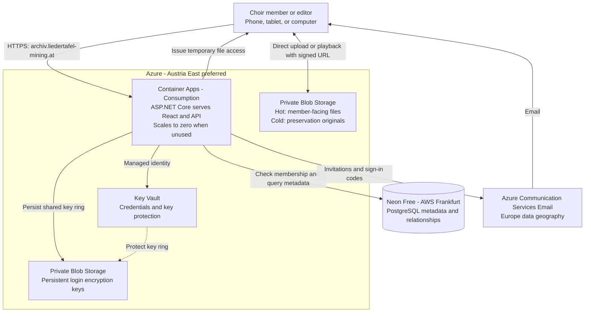
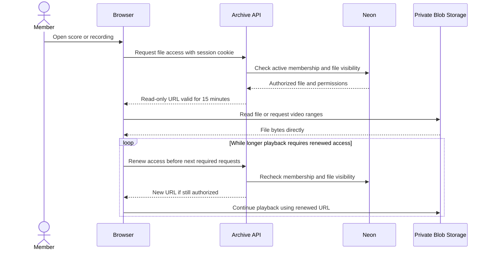
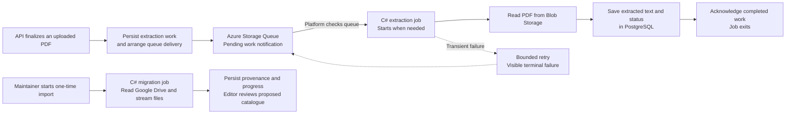
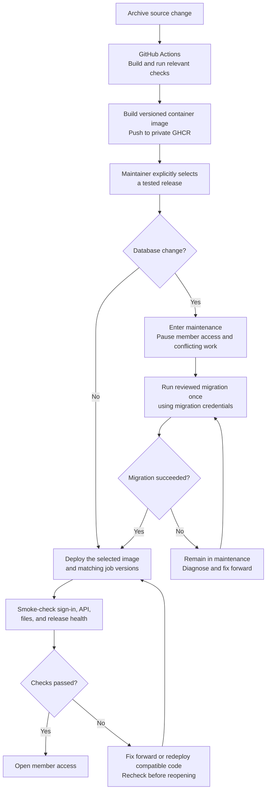
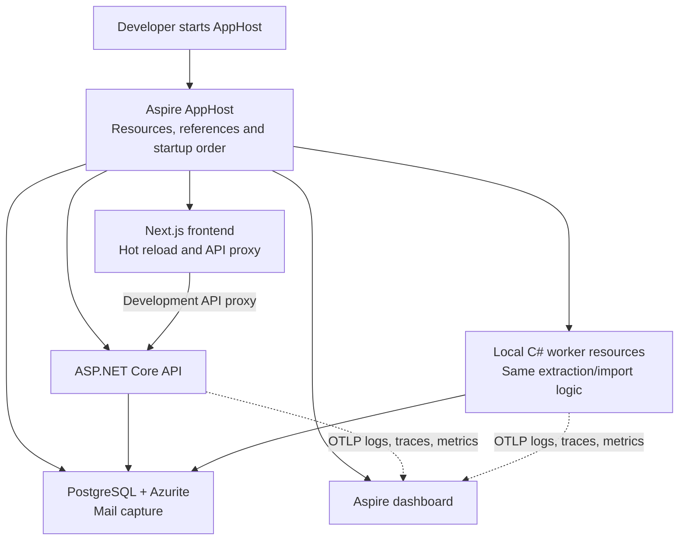

# Liedertafel Choir Archive — Architecture and Deployment

Status: User-confirmed planning baseline, subject to the validation gates below.
Date: 2026-09-11
Implementation: ARC-001 local walking skeleton completed; later slices remain planned.

This document records the architecture interview and supersedes the original
architecture proposal supplied in conversation on 2026-09-08. The
[product requirements document](prd.md) defines the agreed features and release
phases. Provider facts were checked on 2026-09-11; sources are listed below.

Implementation is organized in the [issue index](issues.md). The subsequent
local-development requirement makes Aspire orchestration and development
OpenTelemetry export to its dashboard part of the baseline.

## 1. At a glance

**One sleeping web application, one managed database, and private file storage.**
Members use a normal browser. The application checks access; large files travel
directly between the browser and storage.



The diagram separates **data requests** from **file transfers**. The API does not
relay concert videos. Background jobs and deployment are shown separately below
to keep this overview readable.

| Area | Confirmed baseline |
| --- | --- |
| Frontend | Next.js App Router + React + TypeScript, static export; German, responsive interface |
| Backend | ASP.NET Core, feature modules in one application; EF Core + Npgsql |
| Packaging | One container image serves built frontend files and `/api/*`; no Node.js runtime |
| Hosting | Azure Container Apps Consumption; minimum zero, initial maximum two replicas |
| Public address | `archiv.liedertafel-mining.at`, with Azure-managed HTTPS certificate |
| Azure location | Austria East preferred; West Europe fallback if required checks fail |
| Database | Neon Free, AWS Frankfurt (`aws-eu-central-1`) |
| Files | Private Azure Blob Storage; Hot member-facing files, Cold originals |
| Sign-in | App-owned email codes, delivered by Azure Communication Services Email |
| Secrets | Key Vault; Azure managed identity where supported |
| Background work | Finite C# Container Apps Jobs, with durable progress and retries |
| Infrastructure | Bicep for Azure; documented Neon CLI/API setup (OpenTofu rejected for the single-database scope in ARC-003) |
| Images | Private GitHub Container Registry (GHCR) |
| Environments | Aspire-orchestrated local development plus production; restricted production pilot before general invitations |
| Development telemetry | API and C# workers export OpenTelemetry logs, traces and metrics to the Aspire dashboard over OTLP |
| Production releases | Explicit maintainer-triggered/approved GitHub Actions release |
| Database changes | Once per release, in a maintenance window; small changes and fix-forward handling |
| Operational backups | Deliberately out of scope; editor revision history and trash remain |

## 2. Operating targets and boundaries

- **Budget:** target EUR 10 per normal month, with explicit review before
  accepting a higher recurring commitment. This is a target, not a spending cap.
- **Usage:** up to five simultaneous users; under ten aggregate hours of
  concert-video viewing per month.
- **Collection:** approximately 500 songs/arrangements, 100–500 GB of source
  material, and individual original files up to approximately 10 GB.
- **Responsiveness:** occasional first-visit cold starts of 10–30 seconds are
  acceptable as a provisional target. Normal navigation should be responsive.
- **Maintenance:** one primary maintainer plus a second person able to operate
  the system from written instructions; short monthly operational review.
- **Data geography:** EU primary archive data. Review supporting services such
  as email and, later, AI for their actual data handling.

The archive is an additional application in this repository. The public website
and analytics dashboard retain their separate application and access boundaries.
All archive members share the member-visible collection; editors/admins receive
additional server-enforced permissions.

### Hosting geography

Austria East is the preferred Azure region. Read-only regional provider/SKU
checks found support for Container Apps, Jobs, online GPv2 storage, queues,
Key Vault, and monitoring. This does not establish subscription quota or actual
deployment capacity; the foundation gate must verify those.

Offline Blob **Archive** tier support in Austria East was not established by
regional metadata or capacity pricing. The confirmed design therefore uses
**Cold**, an immediately readable tier, for preservation originals. West Europe
is the fallback region; a tier-policy change is explicit rather than automatic.

Neon's current region documentation says new Azure-region projects are no longer
available. Use AWS Frankfurt for Neon. Moving the Azure components to Austria
does not make the database Austria-resident. Azure Communication Services Email
uses a **Europe data geography**, not a promise of an Austria East datacenter.

## 3. Application, database, and networking

### One deployable application

ASP.NET Core serves the Next.js static export and the API under one origin. React
runs in the browser. Organize backend code into feature modules such as catalogue,
events/programmes, assets/recordings, membership, and import processing, sharing
one application rather than separate microservices.

ARC-001's implementation request selected Next.js instead of Vite. Development
uses Turbopack and an API rewrite; production remains static files with no Node.js
runtime. Routes must be exportable: runtime IDs use client-side API requests and
query parameters unless paths can be generated at build time. SSR, Server Actions
and unbounded dynamic App Router paths require a separate hosting decision.
See the [archive runbook](../../../src/archive/README.md) for the implemented contract.

Database-backed German search covers the PRD's fields, entered lyrics, and
extracted PDF text. PostgreSQL stores the indexed text and relationships. A
dedicated search server and the later chatbot are not launch dependencies.

The detailed schema must distinguish musical versions from file revisions,
working from published programmes, and planned appearances from confirmed
performances. See the [PRD catalogue model](prd.md#3-catalogue-model-and-file-identity).

### Scale-to-zero behaviour

- Use Consumption HTTP scaling with `minReplicas: 0` and initial
  `maxReplicas: 2`. Avoid accidentally running several active release revisions
  with separate replica budgets.
- The first HTML request can wait while the app starts. A separate always-ready
  frontend loading screen is not part of this packaging choice.
- Neon Free currently suspends compute after five inactive minutes. Its timeout
  is fixed on Free, and the database may need to wake as well.
- Use bounded connection retries and explicit failure responses. Never blindly
  retry a partially completed catalogue mutation.
- Avoid keep-alive traffic, routine database polling, and database-dependent
  liveness probes. Finite, necessary work may wake compute.
- Configure bounded database pools and worker concurrency for the small workload;
  validate memory/CPU sizing and connection counts in the pilot.

### Database plan and access

Start with Neon Free and monitor its current allowances: 0.5 GB project storage,
100 CU-hours per project/month, and 5 GB public transfer per project/month. A
**CU-hour** is Neon's measure of database compute size multiplied by running time.
These allowances, including the effect of any temporary branches, must be checked
against actual usage rather than the number of songs alone.

Current Free-plan behaviour suspends compute after exhausting compute/transfer
allowances, and blocks storage-increasing operations at the storage limit. Review
an upgrade before approaching those limits. Neon Launch is a possible later
usage-billed upgrade, not the selected initial plan.

Use encrypted, authenticated PostgreSQL connections. The ordinary application
database role has only runtime permissions; migrations use a separate role.
Neon provisioning API credentials, if needed, belong to provisioning tooling,
not the web application.

### Network boundary

The app is internet-reachable over HTTPS. Privacy comes from server-side
authorization and private storage, rather than requiring a member VPN. Database
connections use encrypted public endpoints; private endpoints and private
cross-cloud networking are not part of the baseline.

Blob containers have no anonymous access. Configure Blob CORS for the required
archive origins, methods, and headers. **CORS** is a browser rule governing
cross-origin requests, not permission to read a private file; the signed URL
supplies that narrowly scoped permission.

## 4. Sign-in, membership, and persistent keys

The application owns invitation and email-code verification. Use supported
ASP.NET Core Identity components rather than inventing identity storage,
cookie encryption or token protection: `IdentityUser<Guid>`/`IdentityRole<Guid>`
users and roles, a custom two-factor token provider for the email codes,
the Identity application cookie with security-stamp validation, and lockout
as the revocation primitive.

- Only invited, active members receive archive access.
- Persist challenge/session state needed for one-time use, expiry, attempt and
  resend limits, and revocation across restarts and multiple replicas.
- Codes are bounded in lifetime and attempts; avoid plaintext code persistence
  and exclude codes, session secrets, and signed URLs from logs.
- Use protected HTTP-only browser cookies and request-forgery protection for
  state-changing operations.
- Remember personal-device sessions for 30 days, with explicit logout. Server
  membership/role checks still apply; reverify sensitive account/role changes.
- Account identity is stable across an approved email change. Administrators
  manage routine member access in the archive.
- Provide a documented, restricted maintainer command for initial administrator
  setup and administrative account repair. There is no shared fallback password.

Azure Communication Services Email delivers invitations and codes using a
recognizable choir-domain sender. Verify domain ownership and sender DNS records
such as SPF/DKIM, which authorize sending and help recipients verify authenticity.
Validate delivery, retries, sender quotas, and Europe data handling with real
member email providers during the pilot. Exact code/attempt/session settings
should be finalized in the authentication implementation design.

### Why login keys need their own storage

The **Data Protection key ring** is ASP.NET's persistent set of encryption keys
for protected application data such as login cookies. A container's local disk
is temporary, so keeping these keys only there would break sessions after a
restart or replacement.

Persist the key ring in a private Blob location and protect it with a Key Vault
key. Share it across instances of this archive, while keeping local-development
keys separate. Retain key versions needed to read still-valid protected data.
This is live application state, not an operational backup system.

**Managed identity** gives the Azure application a platform-managed identity for
Blob, Key Vault, queues, and other supported Azure APIs. Keep external secrets,
such as Neon credentials and the private GHCR pull credential, in Key Vault.
Document access scopes, credential owners, expiry/renewal, and how the second
maintainer replaces a credential. Registry pulls require platform configuration;
the web application's business code need not receive that credential.

## 5. Media transfer and storage

### Playback: authorize first, then stream directly



A signed URL, or **SAS**, is a temporary ticket for a particular file and
operation. Already issued playback tickets remain usable until expiry even if a
member is deactivated. New tickets are refused after revocation. Renewal must be
tested during seeking and long recordings; replacing a media URL must preserve
the playback position and usable player state.

### Uploads

1. An editor requests an upload session for a particular destination/type.
2. The API authorizes it and grants a bounded upload ticket for a unique pending
   object, with an upload lifetime suitable for the permitted size.
3. The browser sends chunks directly to Blob Storage with progress/retry support.
4. Finalization checks the actual object, size, type, and intended association
   before making it available. Retrying finalization must not create duplicates.
5. Required extraction work is queued durably; abandoned pending uploads are
   cleaned up through a bounded maintenance policy.

The approximately 10 GB maximum must be validated against real files, browser
transfer behaviour, and job timeouts. Import jobs stream/chunk large files instead
of staging a whole original on Container Apps' limited temporary local disk.

### Live storage policy

| Material | Baseline handling |
| --- | --- |
| Scores, practice audio/MIDI, member-facing playback copies | Hot, immediately readable |
| Preservation originals with verified usable online material | Cold, immediately readable with higher read charges |
| A file serving as both original and playback copy | One online object; do not create duplicates just to satisfy category names |
| Incompatible original | Preserve it; editor attaches an externally converted playback copy |
| Score revisions | Live catalogue content, retained until explicitly removed |
| Deleted catalogue items/files | Recoverable editor trash for seven days, followed by cleanup |

Cold storage has a 90-day minimum billable retention. Deleting or replacing data
earlier may incur a remaining-retention charge; this does not prevent seven-day
editor-trash cleanup. Original files should use stable object identities rather
than repeated overwrites. Final deletion must respect references from retained
revisions and other catalogue records.

Use standard GPv2 storage, initially priced on LRS: Azure's internal copies
within a datacenter. Those provider-managed durability mechanisms are distinct
from an additional application-operated backup copy.

## 6. Finite background jobs



**Durable work** survives the web application stopping. The queue provides a
notification; persistent work records track progress and outcomes. Design the
database-to-queue handoff so a failure cannot silently lose an extraction request.
Retries are **idempotent**: processing the same item again does not duplicate
assets, text entries, or catalogue records. Permanent failures stay visible for
editor/maintainer action rather than retrying forever.

Use C# job modes within the archive codebase. Azure Container Apps Jobs run finite
executions, with separate identities/permissions where the operation warrants it.
Queue-based scaling checks storage rather than polling the database. Bound job
parallelism, execution duration, and retries to control resource usage.

The initial job use cases are Google Drive import and PDF text extraction.
Necessary cleanup, such as expired trash and abandoned uploads, may use a bounded
scheduled job or suitable storage lifecycle rules. It is maintenance work, not a
keep-alive mechanism. There are no scheduled backup jobs or automatic media
transcoding jobs in this baseline.

The Google Drive importer preserves source references, checkpoints progress,
supports safe reruns, and keeps uncertain matches in editor review. Its scoped
Drive access method is a validation item; credentials stay out of the browser
and image. See the [migration requirements](prd.md#8-google-drive-migration).

## 7. Infrastructure ownership and repository layout

Use dedicated live resources in an archive resource group, provisionally named
`RG-Liedertafel-Archive`. Its deployment permissions are separate from the
existing website/dashboard deployment principal, currently scoped to
`RG-Liedertafel`. Creating the new group and granting identities their roles is a
foundation/bootstrap operation requiring appropriate maintainer privileges.

| Owner/tool | Responsibility |
| --- | --- |
| Bicep | Azure resource topology, configuration, managed identities, and scoped permissions |
| OpenTofu, if adopted | Neon project/provider-managed infrastructure only |
| Documented Neon setup, if OpenTofu is rejected | Explicit project, plan, region, and access configuration |
| EF Core migrations | PostgreSQL application schema |
| Release workflow | Selection/promotion of tested application and job image versions; once-only migrations |
| Archive application/editors | Catalogue, membership, files, and ordinary content lifecycle |

Avoid competing ownership of the deployed image value between foundation Bicep
and the release workflow: use explicit release parameters/inputs so a later
infrastructure run cannot accidentally revert the running image. DNS setup must
likewise have a documented owner and verification steps.

### OpenTofu decision gate — decided in ARC-003

OpenTofu is rejected for the single-database Neon scope. ARC-003 trialled
OpenTofu 1.12.6 with community provider `kislerdm/neon` 0.18.0 on disposable
projects: create/read/update/import and deletion safeguards work, but a
Free-incompatible suspend-timeout setting failed with HTTP 412 after creating
the project, credential-bearing state needs a protected backend and maintenance
owner, and SQL role/grant management is still required. The selected path is the
documented Neon CLI/API setup in `infrastructure/neon/` (runbook plus SQL role
and grant bootstrap). That directory holds no HCL and no provider lock file.
Future adoption requires a fresh decision with a pinned provider/lock file and a
maintainer-owned Azure Blob backend (protected access, encryption, locking, no
runtime access) before any shared state is created.

### Intended layout

```text
docs/plans/006-choir-archive/
  prd.md
  architecture.md
src/archive/
  apphost/                  Aspire local resource orchestration
  service-defaults/         Shared .NET telemetry and service configuration
  frontend/                 Next.js + React + TypeScript, static export
  backend/                  ASP.NET Core feature modules and C# job code
infrastructure/
  archive/                  Archive Bicep entry point/parameters
  modules/                  Reusable Azure modules where appropriate
  neon/                     Neon CLI/API setup runbook and SQL role/grant bootstrap
.github/workflows/
  ...                       Archive-specific checks, provisioning, and release
```

This is the intended organization, not an assertion that these application files
already exist. Select supported framework/package versions and check compatibility
with the repository's pinned .NET SDK during foundation work.

## 8. Build and deployment flow

### Initial provisioning

1. Validate costs, Austria East availability/quota, domain access, and required
   service settings.
2. Bootstrap the archive resource group and scoped deployment identities.
3. Provision Azure resources through Bicep; set up Neon through the selected path.
4. Hand runtime credentials into Key Vault without emitting them into logs or
   ordinary artifacts; configure private GHCR pulls and persistent login keys.
5. Build the first release, apply reviewed schema migrations once, and deploy.
6. Run the restricted production pilot before broad imports/publication and
   general member invitations.

### Routine release



GitHub Actions uses scoped Azure workload identity/OIDC where supported. **OIDC**
here lets a trusted workflow obtain a short-lived Azure identity rather than
storing a long-lived Azure deployment password. Private GHCR image pulls still
need their separately managed GitHub credential.

Keep database-changing releases small and additive where possible, and run them
in a maintenance window. Drain/pause conflicting web writes and jobs before
migration. Do not run migrations on each container startup. A failed migration
must be inspected before retry: the loop in the diagram is a controlled repair
process, not blind repetition of potentially partial SQL changes.

Retain identifiable, tested image versions, preferably selected by immutable
digest. Returning to an older compatible image is a **code rollback**; it does
not roll back the database. The selected database failure strategy is fix-forward
while member access stays paused, not restoration of an earlier database copy.

### Local development and production pilot

**Aspire AppHost is the single local startup entry point.** It starts and connects
the services needed for routine development rather than asking developers to
start each dependency in a separate terminal:

- ASP.NET Core API and the Next.js frontend with Turbopack hot reload. Route browser API
  requests through a documented development proxy so cookie/CSRF behaviour stays
  representative of the single-origin packaged application.
- Local PostgreSQL, with development persistence and an explicit schema setup step.
- Azurite for local Blob and Queue Storage, including required containers/queues.
- A local mail-capture service for invitation and login-code testing.
- Local execution resources for implemented C# workers/job modes. Make manual
  import runs explicitly triggerable rather than starting a real import on boot.
- Aspire's dashboard for resource endpoints/status and development telemetry.

AppHost owns resource references, endpoint/connection injection, readiness order,
and normal start/stop. Routine startup uses development-only identities, keys,
mail and data; no production Neon, Azure Email or Key Vault credential is required.
External-provider checks such as ARC-010's real email test are explicit opt-in
integration runs. Persist local development keys separately from production keys.



### Development OpenTelemetry

**OpenTelemetry (OTel)** is the standard for structured logs, request/work traces
and metrics. **OTLP** is the protocol used to export that data to the Aspire
dashboard. Showing process console output alone does not satisfy this requirement.

- Add a shared .NET Service Defaults project and wire it into the API and every
  C# worker/job host. Keep domain models in their feature libraries, not in this
  configuration project.
- Explicitly enable development OTLP export for **logs, traces and metrics**,
  consuming AppHost-provided endpoint, protocol and authentication configuration
  such as `OTEL_EXPORTER_OTLP_ENDPOINT`. Avoid hard-coded dashboard ports or
  exporter credentials.
- Give resources stable, distinguishable service names; instrument API requests,
  dependency calls and job processing. Carry trace context over queued work and
  preserve it across finite job execution and retry diagnostics.
- Flush telemetry on normal finite-job completion and handled failures so short
  import/extraction runs appear in the dashboard. Report telemetry configuration
  problems rather than silently accepting console-only observability.
- Apply the same sensitive-data redaction locally as in production; ordinary
  development telemetry targets Aspire, not production Azure Monitor.
- Configure health checks and HTTP resilience deliberately. Reusing service
  defaults must not introduce production database keep-alives or unsafe automatic
  retries of state-changing requests.

Verify from a clean local start that the application can use its dependencies,
email is captured, and a browser request plus queued worker execution yield
correlated traces, structured logs and metrics in Aspire. As each worker slice is
implemented it must join AppHost and inherit this telemetry contract.

Aspire orchestrates **local development**. Production remains the selected
single application container plus finite Container Apps Jobs, provisioned with
Bicep and released through GitHub Actions; the Aspire dashboard/AppHost are not
additional production services. Real provider behaviour is verified in the pilot.

There is no standing hosted staging environment. The pilot uses maintainer
accounts and a small representative dataset to verify actual Azure/Neon/email
behaviour before opening the service to members. Temporary disposable provider
trials remain distinct from an ongoing staging environment.

## 9. Retention and operational scope

The user explicitly removed **operational database/media backup and restore**
from this design. Consequently:

- No periodic database exports, daily recovery branches, separate media backup
  copies, backup jobs, or backup resource group are planned.
- No application disaster-restoration workflow or guaranteed recovery time/data
  loss target is part of launch. The earlier 24-hour/two-day/one-week targets are
  superseded.
- Provider-managed durability/default history is not an application backup
  strategy. No additional backup retention is configured by this plan.
- Score revisions remain live catalogue content until explicitly removed, and
  ordinary editor deletion remains recoverable for seven days.
- Persistent live storage, authentication keys, infrastructure state if needed,
  and compatible previous application images retain their normal operational
  purposes.

Use low-volume structured diagnostic logs with bounded, supported Azure retention
settings. Alert on failed deployments/jobs, approaching Azure budget and Neon
allowances, and required credential maintenance. Review these during the monthly
maintainer check. Operational diagnostics are separate from the PRD's enduring
content-change attribution.

Avoid logging login codes, credentials, session cookies, signed file URLs, or
unnecessary document contents. Avoid periodic HTTP availability tests that defeat
scale-to-zero. Exact metrics, retention, alert thresholds, and costs are finalized
in the operational setup, rather than introducing a dedicated monitoring server.

## 10. Cost model

The normal-month target is **EUR 10** for the archive's ordinary operation.
Initial migration activity and the later chatbot are reviewed separately. An Azure
budget alert is a notification, not automatic enforcement of a spending ceiling.

### Illustrative primary-media capacity

Current Austria East reference rates for standard GPv2 LRS storage:

| Capacity | Reference rate |
| --- | --- |
| Hot | EUR 0.0168 per billing GB/month |
| Cold | EUR 0.0039 per billing GB/month |

Azure labels this unit GB but defines it as GiB, or 2³⁰ bytes. Assume, only for
illustration, that online playback copies occupy **20% of original size**:

| Original size | Hot playback size | Monthly capacity calculation | Capacity subtotal |
| --- | --- | --- | --- |
| 100 GiB | 20 GiB | `100 × 0.0039 + 20 × 0.0168` | EUR 0.73 |
| 500 GiB | 100 GiB | `500 × 0.0039 + 100 × 0.0168` | EUR 3.63 |

This represents one set of originals plus usable derivatives, not backup copies.
Measure actual playable/original sizes before using this as an estimate. Scores,
retained revisions, trash, and other live objects also occupy capacity.

The subtotals exclude tax, operations, Cold retrieval, early deletion, network
transfer, application/job compute, email, Key Vault, queues, logs, and any future
database upgrade. Low concurrency does not by itself bound monthly traffic.
Use actual video bitrates and the under-ten-hours viewing estimate to price
transfer, accounting for other usage of subscription-level free allowances.

Neon Free and GHCR currently provide free allowances/services under the selected
plans. Private GHCR avoids Azure Container Registry Basic's fixed registry cost
(approximately EUR 4.29 per 30 days in the checked West Europe reference), while
introducing a pull-credential lifecycle. Azure Container Apps has no
resource-consumption charge for a revision at zero replicas; useful work and
supporting services still need to fit the budget.

**The full monthly total is not yet validated.** Use measured pilot usage and
current regional rates before accepting larger imports or paid commitments.

## 11. Validation gates

These are explicit implementation prerequisites, not claims of completed tests.

| Gate | Required evidence |
| --- | --- |
| Regional foundation | Austria East resource/SKU availability, subscription quota, actual provisioning, TLS/domain binding, and Europe email geography; fallback decision if needed |
| Framework baseline | Supported Aspire/React/.NET/EF/Npgsql/library versions and compatibility with repository tooling |
| Local development | One AppHost start connects frontend/API, PostgreSQL, Azurite, mail and implemented workers; OTel logs/traces/metrics reach Aspire, including finite jobs and queue context |
| Neon provisioning | Provider lifecycle trial and pinned version if OpenTofu is adopted, or complete documented manual setup; Free limits and Frankfurt region verified |
| Source inventory | Actual folder conventions, aggregate size, maximum file sizes, formats, musical versions, and playable/original size ratio |
| App-owned authentication | Invitations, German code delivery, expiry/reuse/attempt controls, 30-day sessions across restart, revocation, and restricted admin repair |
| Permissions | API/search/file operations enforce roles; web runtime, jobs, migration tooling, and release identities have appropriate separate scopes |
| Media transfer | Approximately 10 GB interrupted uploads, safe finalization/reruns, private reads, seek/range support, and renewable 15-minute playback tickets |
| Jobs | Google Drive permissions and streaming import, durable queue handoff, idempotent PDF extraction, bounded retries, and visible failure state |
| Release process | Maintainer-triggered release of a fixed image, once-only maintenance migrations, failure pauses, fix-forward repair, and compatible code rollback |
| Cost and responsiveness | Measured cold starts, realistic five-user requests, media traffic, job runs, memory/CPU sizing, log volume, and projected full monthly cost |
| Member launch | Restricted production pilot passed and PRD content launch gate met |

The grounded chatbot remains a later, read-only feature over the same authorized
queries. Its provider, data handling, and spending controls require a separate
decision before implementation. No dedicated model/search compute or additional
worker language is required by this baseline.

## 12. Reference glossary

| Term | Meaning here |
| --- | --- |
| Container image | A packaged application release, containing code/static files rather than choir data or runtime secrets |
| Aspire AppHost | Local orchestrator that starts application services/dependencies and supplies their connections |
| Aspire dashboard | Local resource/status view and destination for development telemetry |
| OpenTelemetry / OTLP | Logs, traces and metrics instrumentation / the protocol exporting those signals to Aspire |
| Replica | One running instance of that application image |
| Cold start | Time spent starting a stopped app/database for the next real request |
| Hot / Cold / Archive | Storage tiers: Hot and Cold are online; Archive is offline. Cold is the selected originals tier |
| Managed identity | Azure-managed application identity for accessing supported Azure services |
| Key Vault | Managed storage/protection for credentials and encryption keys |
| Data Protection key ring | Persistent ASP.NET keys needed for protected data such as login cookies |
| Signed URL / SAS | Time-limited permission for a particular storage object and operation |
| Durable job | Finite background work with progress/retry state that survives the web app stopping |
| Idempotent | Safe to retry without duplicating the operation's intended result |
| Migration | A versioned change to database structure, distinct from transferring the old Drive collection |
| Fix forward | Repair the current schema/code state instead of restoring an earlier database |
| Infrastructure state | OpenTofu's sensitive record of resources it manages; not catalogue data |

## 13. Sources and checks

Checked 2026-09-11. Rates are reference retail values, not an account-specific
quote. Recheck provider limits, region availability, and pricing before deployment.

- [Container Apps billing](https://learn.microsoft.com/en-us/azure/container-apps/billing),
  [scaling](https://learn.microsoft.com/en-us/azure/container-apps/scale-app),
  [workload profiles](https://learn.microsoft.com/en-us/azure/container-apps/workload-profiles-overview),
  [Jobs](https://learn.microsoft.com/en-us/azure/container-apps/jobs), and
  [temporary storage](https://learn.microsoft.com/en-us/azure/container-apps/storage-mounts).
- [Managed custom-domain certificates](https://learn.microsoft.com/en-us/azure/container-apps/custom-domains-managed-certificates).
- [Neon plans and Free limits](https://neon.com/docs/introduction/plans),
  [regions](https://neon.com/docs/introduction/regions), and
  [usage calculations](https://neon.com/docs/introduction/usage-calculations).
- [Blob tiers and minimum billing periods](https://learn.microsoft.com/en-us/azure/storage/blobs/access-tiers-overview),
  [storage redundancy](https://learn.microsoft.com/en-us/azure/storage/common/storage-redundancy), and
  [Blob pricing/billing units](https://azure.microsoft.com/en-us/pricing/details/storage/blobs/).
- [Azure Retail Prices API](https://learn.microsoft.com/en-us/rest/api/cost-management/retail-prices/azure-retail-prices).
  Capacity queries used EUR, `armRegionName = austriaeast` (or `westeurope`),
  `productName = General Block Blob v2`, first-tier LRS `Data Stored` meters.
  Austria East returned Hot 0.0168, Cold 0.0039, and no Archive capacity meter;
  West Europe returned Archive 0.0015. An Archive early-deletion meter alone was
  not treated as proof of tier availability.
- Read-only Azure resource-provider locations and
  [Storage SKUs](https://learn.microsoft.com/en-us/rest/api/storagerp/skus/list)
  checks for Austria East. These checked advertised support, not successful
  provisioning or guaranteed available capacity.
- [Azure Communication Services Email](https://learn.microsoft.com/en-us/azure/communication-services/concepts/email/email-overview),
  [custom sender domains](https://learn.microsoft.com/en-us/azure/communication-services/quickstarts/email/add-custom-verified-domains), and
  [data geography](https://learn.microsoft.com/en-us/azure/communication-services/concepts/privacy).
- [ASP.NET Data Protection configuration](https://learn.microsoft.com/en-us/aspnet/core/security/data-protection/configuration/overview).
- [Aspire C# Service Defaults and OTLP export](https://aspire.dev/get-started/csharp-service-defaults/),
  [Blob/Azurite hosting integration](https://aspire.dev/integrations/cloud/azure/azure-storage-blobs/azure-storage-blobs-host/), and
  [Queue Storage hosting integration](https://aspire.dev/integrations/cloud/azure/azure-storage-queues/azure-storage-queues-host/).
- [GHCR access/authentication](https://docs.github.com/en/packages/working-with-a-github-packages-registry/working-with-the-container-registry) and
  [GitHub Packages billing](https://docs.github.com/en/billing/concepts/product-billing/github-packages).
- Repository baseline inspected: `infrastructure/main.bicep`,
  `infrastructure/main.bicepparam`, existing infrastructure/application workflows,
  root `AGENTS.md`, and [the PRD](prd.md). Existing resource-group identity scopes
  require explicit bootstrap work for the additional archive group.
