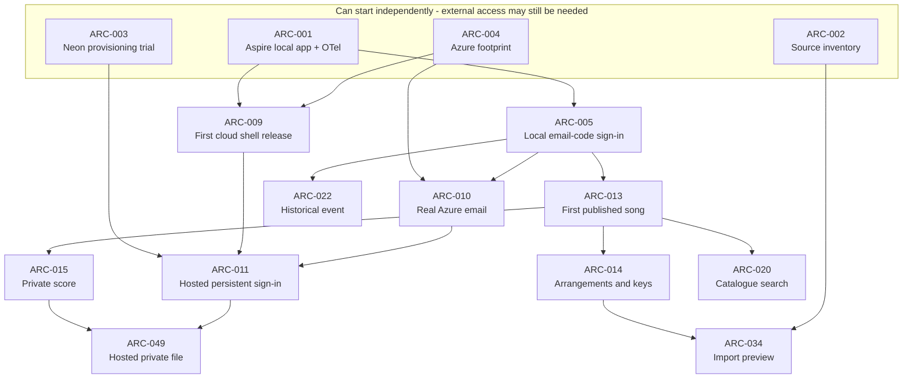

# Choir Archive — Implementation Issue Index

Status: ARC-001 completed; remaining implementation issues are planned.
Date: 2026-09-11
Sources: [PRD](prd.md) · [Architecture](architecture.md)

**Start here to pick work:** [ARC-002], [ARC-003] and [ARC-004]
have no implementation dependencies and can start in parallel, subject to their
external access requirements. Completed [ARC-001] provides **Aspire local
orchestration and development OpenTelemetry export to the Aspire dashboard**;
[ARC-005] is also unblocked by that foundation.

There are **49 file-based issues** in this directory: 42 core issues, two launch
gates, three follow-up slices and two later AI issues. IDs are stable identifiers,
not priority numbers or a mandatory execution order. For example, ARC-048 is a
follow-up arrangement merge, while ARC-049 is an early core live-storage slice.

## How to read and update an issue

Each file has machine-readable YAML frontmatter plus a visible **Depends on**
line with links, an outcome, acceptance criteria, verification and handoff notes.

```yaml
id: ARC-015
status: planned
phase: core
kind: slice
depends_on: ["ARC-013"]
touches: ["assets", "catalogue-materials", "storage", "db-migrations"]
external_inputs: []
```

| Marker | Meaning |
| --- | --- |
| `id` | Stable issue identifier; keep it when changing the title |
| `status` | `planned`, `in_progress`, `blocked`, or `done`; completion requires the stated verification |
| `phase` | `core`, `launch`, `follow-up`, or `later`; default work scope is core plus its launch gates |
| `kind` | `slice` for a working journey; `enabler`, `discovery`, `decision`, or `validation` for explicitly bounded supporting work |
| `depends_on` | Canonical list of **direct, required** predecessor IDs; `[]` means no implementation dependency |
| `touches` | Shared code/configuration hotspots; overlap calls for coordination rather than automatically blocking the whole issue |
| `external_inputs` | Access, samples or operator choices needed beyond completed implementation issues |

An issue is **ready to start** when it is planned, its phase is enabled, every
`depends_on` issue is done, and its external inputs are available. If blocked,
record the concrete reason and what will unblock it in the issue.

Update the issue frontmatter, visible dependency links and this index together
when changing dependencies. Add only necessary direct prerequisites; their
ancestors are inherited. Enabling a later phase is a prioritization decision,
not a reason to add a false code dependency on the launch issue.

## Early parallel paths

This diagram shows the **early branching only**. The full direct dependencies
for every issue are in the tables below.



For example, once local sign-in is complete, member administration, the first
song and historical event entry can progress while hosting/email integration is
still underway. The source-preview path does not wait for the PDF worker.

## Dependency-only parallel layers

These are the earliest topological layers for **core + launch**, with all
predecessors assumed finished. They are **not sprints or batch barriers**: start
an issue as soon as its own dependencies are done, without waiting for unrelated
issues in an earlier row. External inputs and shared edits still apply.

| Layer | Issues that can become ready together |
| --- | --- |
| 0 | [ARC-001], [ARC-002], [ARC-003], [ARC-004] |
| 1 | [ARC-005], [ARC-009] |
| 2 | [ARC-006], [ARC-007], [ARC-008], [ARC-010], [ARC-013], [ARC-022] |
| 3 | [ARC-011], [ARC-014], [ARC-015], [ARC-020], [ARC-026] |
| 4 | [ARC-012], [ARC-016], [ARC-017], [ARC-021], [ARC-023], [ARC-024], [ARC-029], [ARC-031], [ARC-034], [ARC-041], [ARC-049] |
| 5 | [ARC-018], [ARC-019], [ARC-025], [ARC-027], [ARC-032], [ARC-035], [ARC-037] |
| 6 | [ARC-028], [ARC-033], [ARC-036], [ARC-040] |
| 7 | [ARC-030], [ARC-038], [ARC-039] |
| 8 | [ARC-042] |
| 9 | [ARC-043] |

### Coordination that is not a dependency

- **EF migrations:** feature work can run in parallel, but coordinate migration
  generation/integration and the shared model snapshot. Do not replace another
  slice's migration or invent an up-front whole-domain-schema blocker.
- **Aspire and Service Defaults:** ARC-001 owns the initial resource/reference and
  OTLP contract. Worker slices add their resources; coordinate AppHost/config edits
  while implementing the actual feature logic independently.
- **Auth/admin:** ARC-006/007/008 share membership screens/state and should agree
  route/component ownership before concurrent implementation.
- **Assets and players:** preserve ARC-015's owner/revision/ticket contracts while
  batches, resumable uploads, revisions, event files and import extend them.
- **Song/search/event pages:** use the extension points in completed slices;
  coordinate route composition and avoid duplicating visibility/permission rules.
- **Cloud configuration:** Bicep resources, job definitions, alert destinations
  and release inputs need an integration owner even when worker code is independent.

If an interface really changes and another issue cannot finish without that
change, add an explicit dependency or a small prerequisite slice. `touches` is
not permission to hide such a dependency in prose.

## Core implementation

Supporting issues 001–004/009 have bounded runnable or decision outcomes; the
product slices each own their UI/API/data/authorization work as required.

| ID | Slice / outcome | Direct dependencies | Shared areas |
| --- | --- | --- | --- |
| [ARC-001] | Start local app/services with Aspire and see OTel signals | — | AppHost, Service Defaults, shell, tooling |
| [ARC-002] | Measure representative source folders and files | — | Import fixtures, planning |
| [ARC-003] | Prove/select Neon provisioning | — | Neon configuration, planning |
| [ARC-004] | Confirm Austria East footprint and costs | — | Azure foundation, DNS, planning |
| [ARC-005] | Invited member signs in with an email code | [ARC-001] | Auth, shell |
| [ARC-006] | Administrator invites another member | [ARC-005] | Membership admin, auth |
| [ARC-007] | Existing sessions obey revocation/role changes | [ARC-005] | Membership admin, auth |
| [ARC-008] | Repair account email/admin access | [ARC-005] | Membership admin, operator commands |
| [ARC-009] | Release packaged shell to the archive domain | [ARC-001], [ARC-004] | Azure foundation, release workflow |
| [ARC-010] | Receive real German invitation/login email | [ARC-004], [ARC-005] | Email, sender DNS, auth |
| [ARC-011] | Hosted sign-in survives restart | [ARC-003], [ARC-009], [ARC-010] | Auth, keys, Neon, runtime configuration |
| [ARC-012] | Apply one migration in a maintenance release | [ARC-011] | Release workflow, maintenance |
| [ARC-013] | Publish the first song and musical identity | [ARC-005] | Catalogue, shell |
| [ARC-014] | Choose arrangements and transposed versions | [ARC-013] | Catalogue, picker |
| [ARC-015] | Upload/read one private score | [ARC-013] | Assets, storage, catalogue materials |
| [ARC-049] | Upload/read that private file on real Azure storage | [ARC-011], [ARC-015] | Live Blob integration, assets |
| [ARC-016] | Upload a labelled batch of voice files | [ARC-015] | Assets, catalogue materials |
| [ARC-017] | Resume an interrupted approximately 10 GB upload | [ARC-002], [ARC-015] | Upload client, storage |
| [ARC-018] | Play practice audio through ticket renewal | [ARC-016] | Media player, assets |
| [ARC-019] | Listen to MIDI with tempo control | [ARC-016] | MIDI player, catalogue materials |
| [ARC-020] | Search titles, creators and entered lyrics | [ARC-013] | Search, catalogue, home |
| [ARC-021] | Filter musical versions and available practice files | [ARC-014], [ARC-015], [ARC-020] | Search, catalogue |
| [ARC-022] | Publish an event with explicit date uncertainty | [ARC-005] | Events, navigation |
| [ARC-023] | Read historical programme scans/photos | [ARC-015], [ARC-022] | Event materials, assets |
| [ARC-024] | Publish an ordered upcoming programme | [ARC-014], [ARC-022] | Programmes, events |
| [ARC-025] | Publish a revision without exposing unfinished edits | [ARC-024] | Programmes |
| [ARC-026] | Record confirmed performance or programme evidence | [ARC-013], [ARC-022] | Performances, events |
| [ARC-027] | Confirm actual songs, skips and encore | [ARC-024], [ARC-026] | Programmes, performances |
| [ARC-028] | Publish/play a whole concert recording | [ARC-018], [ARC-023] | Recordings, event materials, player |
| [ARC-029] | Read song history and honest occurrence counts | [ARC-026] | Song history, performances |
| [ARC-030] | Jump to indexed passages and find recorded songs | [ARC-021], [ARC-028], [ARC-029] | Recordings, history, search |
| [ARC-031] | Correct a score while preserving revisions | [ARC-015] | Assets, catalogue materials |
| [ARC-032] | Extract PDF text with visible durable job status | [ARC-012], [ARC-049] | Extraction, Azure jobs, AppHost, OTel |
| [ARC-033] | Search inside the current authorized score | [ARC-020], [ARC-031], [ARC-032] | Search, extraction, revisions |
| [ARC-034] | Preview folder-to-catalogue mapping | [ARC-002], [ARC-014] | Import, catalogue |
| [ARC-035] | Copy one reviewed Drive folder safely | [ARC-012], [ARC-017], [ARC-034], [ARC-049] | Import, assets, jobs, AppHost, OTel |
| [ARC-036] | Bulk-publish clear imports and resolve ambiguity | [ARC-035] | Import, catalogue, assets |
| [ARC-037] | Recover deleted catalogue items within seven days | [ARC-031] | Catalogue trash, assets |
| [ARC-038] | Recover a deleted event with its linked history | [ARC-025], [ARC-027], [ARC-028], [ARC-037] | Event trash, programmes, recordings |
| [ARC-039] | Keep playback Hot and separate originals Cold | [ARC-017], [ARC-028], [ARC-049] | Storage tiers, recordings |
| [ARC-040] | Receive actionable failed-job/release alerts | [ARC-032], [ARC-035] | Observability, alerts, jobs |
| [ARC-041] | Notice cost/quota/credential limits | [ARC-002], [ARC-011] | Observability, alerts, operator checks |

## Launch gates

ARC-042 depends on the terminal core slices. Following their dependency chains
covers **every core issue ARC-001 through ARC-041 plus ARC-049**. Its purpose is verification
on the real deployment; feature implementation belongs in the slices above.

| ID | Slice / outcome | Direct dependencies | Shared areas |
| --- | --- | --- | --- |
| [ARC-042] | Restricted production pilot and final cost/performance evidence | [ARC-006], [ARC-007], [ARC-008], [ARC-019], [ARC-030], [ARC-033], [ARC-036], [ARC-038], [ARC-039], [ARC-040], [ARC-041] | Pilot evidence, planning |
| [ARC-043] | Reviewed catalogue/history rollout and member invitations | [ARC-042] | Launch content, editor coordination |

## Follow-up phase

These remain outside the first member-release gate. Enable this phase deliberately;
their dependencies describe required capabilities rather than an artificial
requirement to finish all other post-launch work first.

| ID | Slice / outcome | Direct dependencies | Shared areas |
| --- | --- | --- | --- |
| [ARC-044] | Merge duplicate songs and preserve links | [ARC-030], [ARC-033], [ARC-036], [ARC-038] | Merge, catalogue, history, import |
| [ARC-048] | Merge duplicate arrangements with explicit key mapping | [ARC-044] | Merge, assets, programmes |
| [ARC-045] | Member correction with attachment and editor resolution | [ARC-030], [ARC-038] | Corrections, assets |

## Later AI phase

ARC-046 has no code prerequisites, but its phase is **later**, so it is not a fifth
initial core task. The chatbot can follow its actual prerequisites without waiting
for the merge or correction-inbox features.

| ID | Slice / outcome | Direct dependencies | Shared areas |
| --- | --- | --- | --- |
| [ARC-046] | Choose/test an appropriate AI provider and bounded question | — | AI evaluation, planning |
| [ARC-047] | Answer a German history question with authorized citations | [ARC-007], [ARC-030], [ARC-033], [ARC-046] | Chatbot, search, history |

## External inputs

These markers are access/data prerequisites, not extra implementation issues.
Record availability with the issue owner; a dependency-free task may still need
one of them before it can start.

| Marker | Required input |
| --- | --- |
| `drive-sample-access` | Authorized read access to representative source folders/files, or approved exports |
| `drive-migration-access` | Scoped access to the source collection selected for the actual migration |
| `neon-maintainer-access` | Ability to inspect/provision the intended Neon organization/projects |
| `azure-maintainer-access` | Appropriate subscription/RG/role permissions for the stated operation |
| `dns-maintainer-access` | Ability to validate/configure archive hostname, certificate and email sender records |
| `github-package-access` | Private GHCR publication/pull setup and permitted release workflow access |
| `pilot-mailboxes` | Real consenting test inboxes across representative member email providers |
| `pilot-devices` | Representative phone/tablet/desktop browser access for playback and upload validation |
| `maintainer-alert-destinations` | Primary/secondary maintainer notification destinations and ownership |
| `launch-content-selection` | Editor-selected concerts and source batches for the agreed launch coverage |
| `member-invitation-list` | Approved current-member/musical-leadership recipients and intended roles |
| `ai-evaluation-access` | Later-phase provider evaluation access and budget/data-handling decision authority |
| `ai-runtime-credentials` | Credentials and allowed settings for the provider selected in ARC-046 |

## Shared definition of done

- Demonstrate the stated journey through the real relevant layers: UI/API/data
  and permissions for a product slice, or the stated runnable outcome for an enabler.
- Keep German copy, accessibility, explicit incomplete-data states and the agreed
  app boundary. A component/schema-only change does not complete a user journey.
- Run relevant meaningful checks and record actual commands/results in the issue.
  Extend the repo guidance when introducing a test/startup command or tool.
- Add new local resources/workers to **Aspire AppHost**. API/worker OpenTelemetry
  **logs, traces and metrics** must reach the Aspire dashboard in development;
  queue/finite-job work must retain useful trace context and flush telemetry.
- Preserve authorization, publication/deletion visibility, edit attribution,
  idempotent retries and reference integrity when adding new relationships.
- Product flows should run locally through Aspire where provider emulation is
  appropriate. Tickets that explicitly require live cloud behaviour include the
  corresponding external access markers and verification; the pilot rechecks them.
- Use the existing single-container production release path and finite C# jobs.
  Operational backups/restoration, OCR and automatic transcoding are not added by
  these issues. Seven-day editor trash and retained score revisions remain in scope.
- Coordinate shared changes, integrate required migrations, and update status to
  `done` only after acceptance and verification are complete.

## Scope coverage

| PRD / architecture area | Owning slices |
| --- | --- |
| Aspire startup, development services and OTel | [ARC-001], [ARC-032], [ARC-035], [ARC-040], [ARC-042] |
| Invitations, roles, email repair, 30-day sessions | [ARC-005], [ARC-006], [ARC-007], [ARC-008], [ARC-010], [ARC-011] |
| Regional/provider choices and private-image deployment | [ARC-003], [ARC-004], [ARC-009], [ARC-011], [ARC-012] |
| Song/arrangement/musical-version identity | [ARC-013], [ARC-014] |
| Private files, voice labels, large uploads and score revisions | [ARC-015], [ARC-049], [ARC-016], [ARC-017], [ARC-031] |
| Audio, MIDI, concert video, passages and media tiers | [ARC-018], [ARC-019], [ARC-028], [ARC-030], [ARC-039] |
| Metadata/lyric/filter/PDF search | [ARC-020], [ARC-021], [ARC-030], [ARC-032], [ARC-033] |
| Event-centred history, documents and uncertainty | [ARC-022], [ARC-023], [ARC-026], [ARC-029] |
| Published programmes, revisions and actual confirmation | [ARC-024], [ARC-025], [ARC-027] |
| Drive mapping, copied files, review and safe reruns | [ARC-002], [ARC-034], [ARC-035], [ARC-036] |
| Editor deletion/recovery and retained references | [ARC-031], [ARC-037], [ARC-038] |
| Diagnostics, notifications, quota/cost/credential checks | [ARC-040], [ARC-041] |
| Restricted pilot and reviewed member rollout | [ARC-042], [ARC-043] |
| Follow-up merges and corrections | [ARC-044], [ARC-048], [ARC-045] |
| Later grounded chatbot | [ARC-046], [ARC-047] |

[ARC-001]: ARC-001-local-walking-skeleton.md
[ARC-002]: ARC-002-source-inventory.md
[ARC-003]: ARC-003-neon-provisioning-trial.md
[ARC-004]: ARC-004-azure-footprint.md
[ARC-005]: ARC-005-email-code-sign-in.md
[ARC-006]: ARC-006-member-invitations.md
[ARC-007]: ARC-007-membership-revocation.md
[ARC-008]: ARC-008-account-repair.md
[ARC-009]: ARC-009-first-cloud-release.md
[ARC-010]: ARC-010-azure-login-email.md
[ARC-011]: ARC-011-hosted-persistent-sign-in.md
[ARC-012]: ARC-012-maintenance-release.md
[ARC-013]: ARC-013-first-published-song.md
[ARC-014]: ARC-014-arrangements-and-keys.md
[ARC-015]: ARC-015-private-score.md
[ARC-016]: ARC-016-voice-file-batches.md
[ARC-017]: ARC-017-large-upload-resume.md
[ARC-018]: ARC-018-practice-audio.md
[ARC-019]: ARC-019-midi-listening.md
[ARC-020]: ARC-020-catalogue-search.md
[ARC-021]: ARC-021-repertoire-filters.md
[ARC-022]: ARC-022-historical-event.md
[ARC-023]: ARC-023-event-documents.md
[ARC-024]: ARC-024-publish-programme.md
[ARC-025]: ARC-025-programme-revisions.md
[ARC-026]: ARC-026-performance-evidence.md
[ARC-027]: ARC-027-confirm-actual-programme.md
[ARC-028]: ARC-028-concert-recording.md
[ARC-029]: ARC-029-song-history.md
[ARC-030]: ARC-030-recording-passages.md
[ARC-031]: ARC-031-score-revisions.md
[ARC-032]: ARC-032-pdf-extraction.md
[ARC-033]: ARC-033-search-score-text.md
[ARC-034]: ARC-034-import-preview.md
[ARC-035]: ARC-035-copy-reviewed-folder.md
[ARC-036]: ARC-036-import-review-publication.md
[ARC-037]: ARC-037-catalogue-trash.md
[ARC-038]: ARC-038-event-trash.md
[ARC-039]: ARC-039-live-media-tiers.md
[ARC-040]: ARC-040-failure-alerts.md
[ARC-041]: ARC-041-cost-and-quota-alerts.md
[ARC-042]: ARC-042-restricted-production-pilot.md
[ARC-043]: ARC-043-member-launch.md
[ARC-044]: ARC-044-merge-songs.md
[ARC-045]: ARC-045-member-corrections.md
[ARC-046]: ARC-046-chatbot-provider-decision.md
[ARC-047]: ARC-047-grounded-history-answer.md
[ARC-048]: ARC-048-merge-arrangements.md
[ARC-049]: ARC-049-hosted-private-file.md
