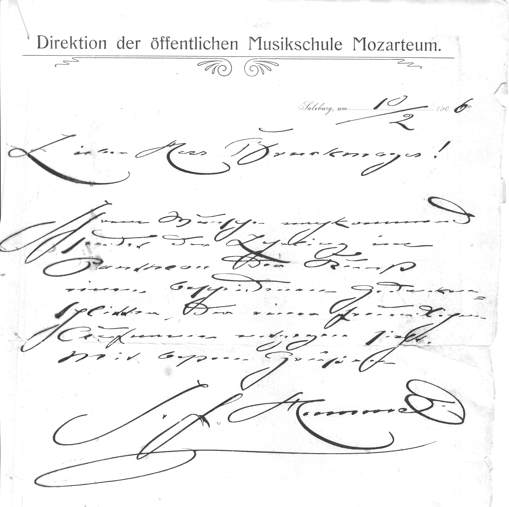
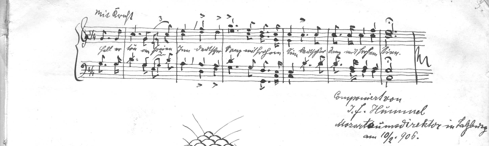

Auch der Ursprung des Vereinsmottos datiert aus der Zeit vor der Vereinsgründung und es hat eine durchaus edle Herkunft.
Der erste Direktor des Mozarteums in Salzburg, J.F. Hummel, schreibt am 10. Februar 1906: „Lieber Herr Bruckmayr! Ihrem Wunsche nachkommend, sendet der Lehrling ein Pantheon der Kunst, einen bescheidenen Gedankensplitter, der einer freundlichen Aufnahme entgegensieht.“

