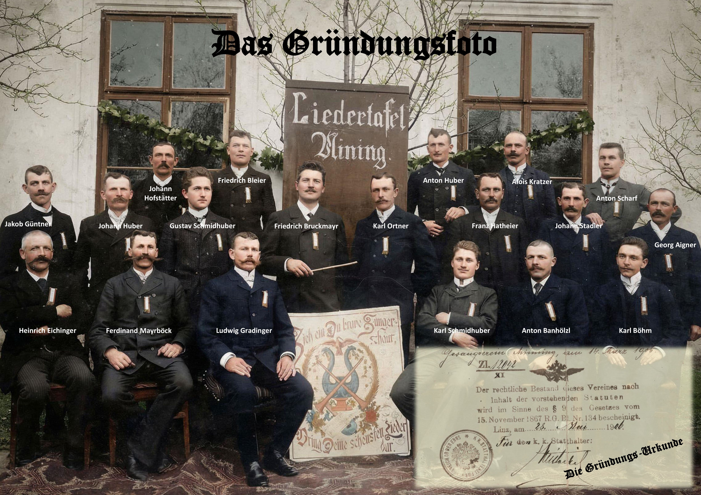

In der Sitzung vom 11. März 1906 werden die Statuten des Gesangsvereines Ried im Innkreis zur Vorlesung gebracht und es wird beschlossen, diese zu übernehmen.
Am 14. März 1906 werden diese als „Satzungen des Gesangsvereines in Mining“ bei der „K&K Stadthalterei für Österreich ob der Enns“ mit Einlagezahl 12042 eingereicht und mit Datum 28. Mai 1906 formell genehmigt.

