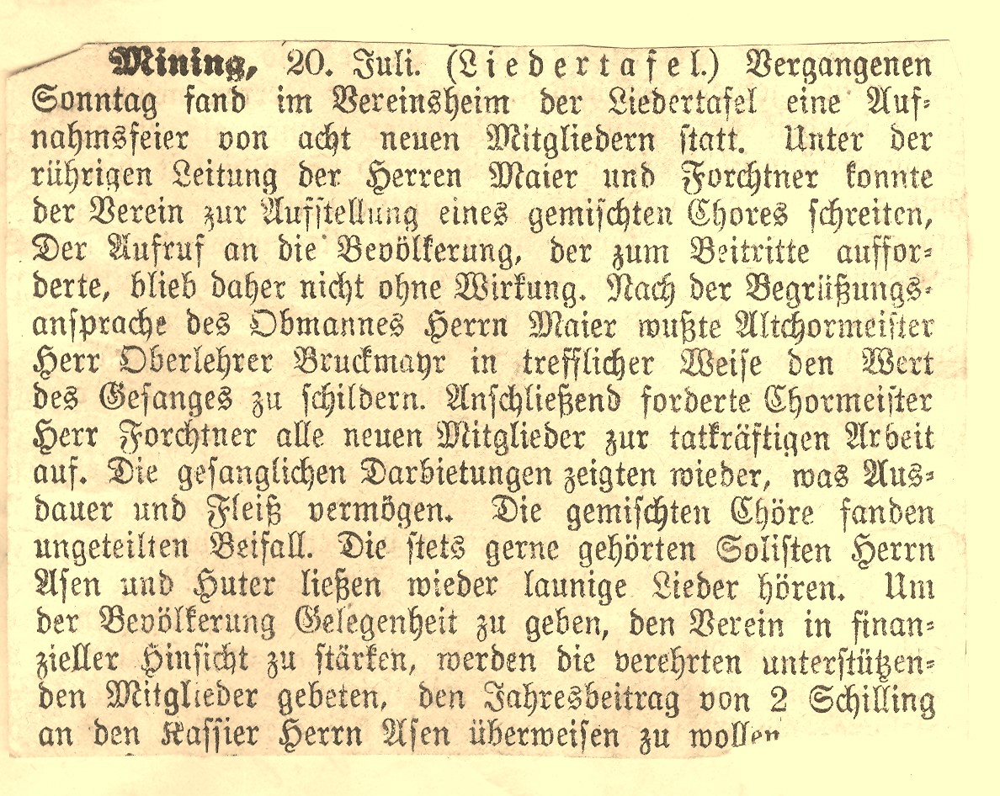
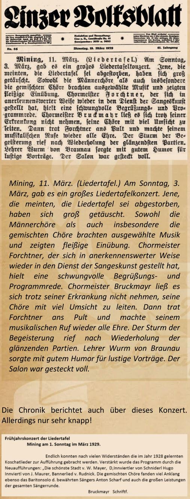

Frauen haben in der Frage des Fortbestands der Liedertafel immer eine Rolle gespielt. Das ist ein offenes Geheimnis. Sie sind in einer funktionierenden Partnerschaft nicht selten der entscheidende Faktor bei der Frage, ob ein Mann für die Sache des Gesanges zu haben ist oder nicht. Das war wohl schon immer so und es hat sich bis in die heutige Zeit nicht geändert. In der Vereinsgeschichte gab es aber auch aktive weibliche Mitglieder und das dürfte weniger bekannt sein. Das Protokoll der Vorstandssitzung vom 20. Juli 1925 lässt keinen Zweifel über die Aufnahme von Damen in die Liedertafel Mining. Im Laufe der Folgejahre gibt es also auch gesangliche Darbietungen eines Damenchores, sowie eines gemischten Chores. Doch die Spur der im Verein aktiven Damen verliert sich dann wieder und zwar ohne jegliche Erwähnung durch die Chronisten.

