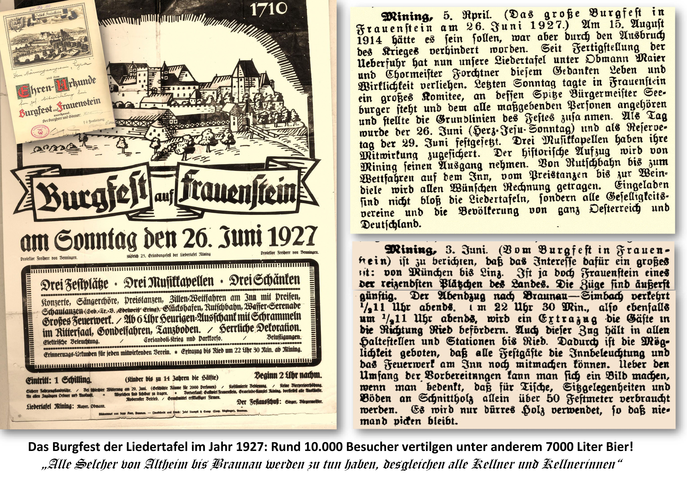

Zitat aus einer Presseankündigung: „Eingeladen sind nicht bloß die Liedertafeln, sondern alle Geselligkeitsvereine und die Bevölkerung von ganz Österreich und Deutschland“!

Ursprünglich geplant für den 15. August 1914 kam jedoch der 1. Weltkrieg dazwischen, der das gesellschaftliche Leben zum Erliegen brachte. So wurde erst am 4. April 1925 der nächste Grundsatzbeschluss zur Abhaltung des Burgfestes gefasst. Als Festtermin wurde der 26. Juni 1927 festgelegt. In Anbetracht der damaligen Rahmenbedingungen war das sicherlich eine organisatorische und logistische Meisterleistung.

Der nachfolgende Chronikeintrag lässt das erahnen:  
Es war eine Riesenarbeit um das Fest vorzubereiten, weil doch Frauenstein ein Platz ist, wo große Veranstaltungen noch nie stattgefunden haben. Um ein Bild zu geben sei erwähnt (alphabetisch) dass z.B. alle Adressen für die Einladungen beschafft werden mussten. Ansichtskarten wurden bestellt und die Affichierung der Plakate war zu regeln. Weiters in Schlagworten Beflaggung der Ortschaften Mining und Frauenstein, Bedienung, Bäcker, Biermarken, Brotmarken, Barrets, Blocks für Fahrräder, Motorräder u. Autos, Konditor, Diplome, Dekoration, Damen für die Mitarbeit, Extrazug, Elektr. Licht, Essenmarken, Ehrendamen, Festzeichen, Flaggenmaste, Fahnen, Fahrzeug Aufsicht, Fahrzeugplatz, Feuerwerk, Fuhrwerk f. Lasten und für die Musik, Girlanden, Glückshafen, Gendarmeriedienst, Gondelfahren, Gesamtchor, Gemeinde-Polizei, Gesangvereine, Inserate, Komiteezeichen, Kaffeschank, Kassen I-IV Kontrolle, Kostüme, Koncert, Lampions, Kerzen, Landsknechte, Metzger Musik I II III, Noten, Ordner, Plakate, Pöller, Preisverteilung, Podien, Rittersaal (Decoration, Tische, Sitze Licht, Sanitätsdienst, Serenade am Inn, Spenden v. Glückshafen, Schrammelquartett, Schiffahren Steine am Wasserbauplatz, Trafik, Tanzmeister Tanz Richter, Triumphbögen, Tafeln, Tischordnung Trinkgefäße, Tanzpreise, Überfuhr, Versand der Plakate, Versicherung, Vorverkauf, Verkauf der Lose Weinschank u. Zecheneinladungen.

Anmerkung für die Redaktion: Zitat aus der Chronik bitte kursiv!

Auch die regionalen Zeitungen berichteten sehr umfangreich über dieses große Fest. Im Anhang dazu nur einige Beispiele!

