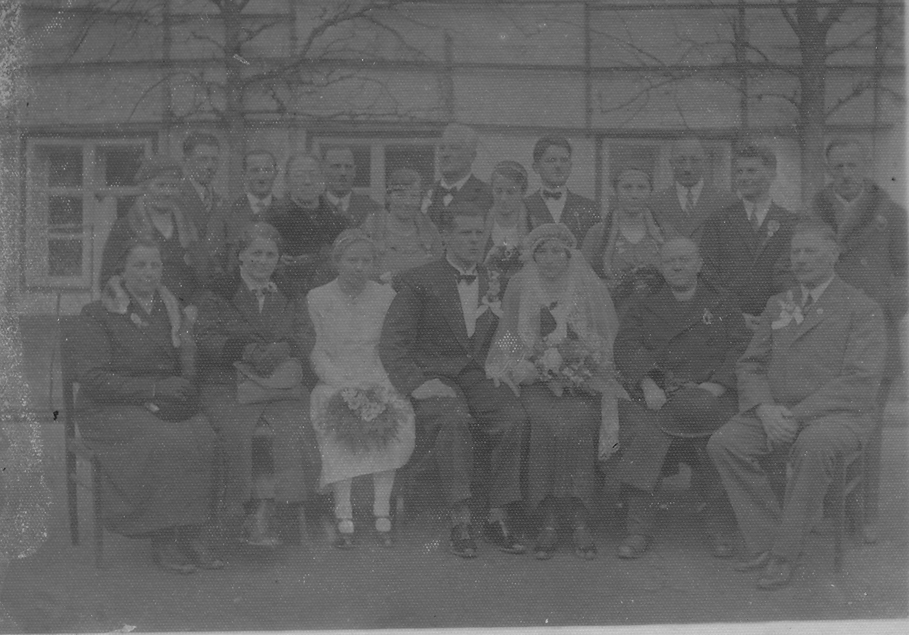
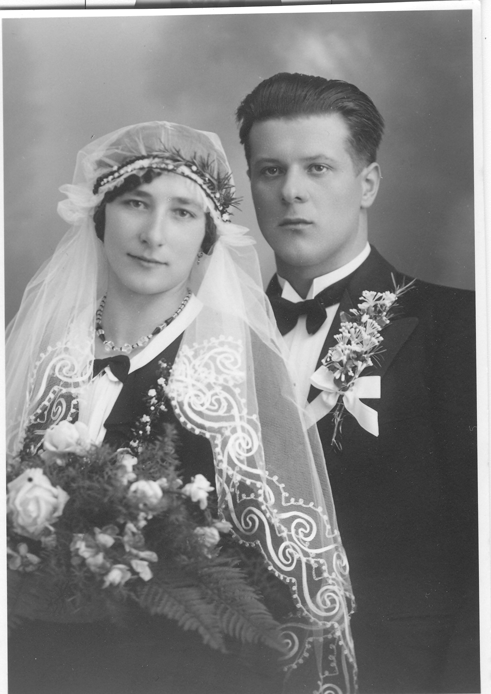

Friedrich Bruckmayr (jun.), der Sohn des Vereinsgründers und ersten Chorleiters, heiratet am 5. März 1935 Anna Asen, die Tochter des Obmanns Matthias Asen. Das ist für den Verein natürlich ein ganz besonderes Ereignis, das auch entsprechend gefeiert wird. Der Bräutigam war auch ganz kurz Sänger der Liedertafel, wurde aber wenige Monate vor der Hochzeit als Oberlehrer nach Riedlbach bei Mondsee berufen, musste deshalb umziehen und die Liedertafel rasch wieder verlassen. Das Eheglück währte leider nicht sehr lange. Seine Frau Anna starb bereits im Jahr 1948 an Kinderlähmung.

