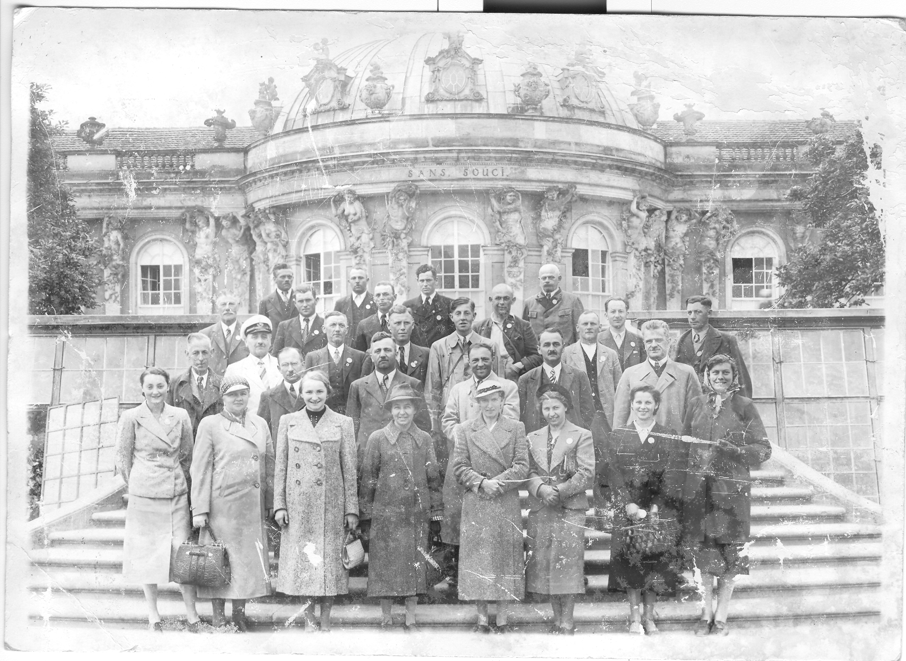
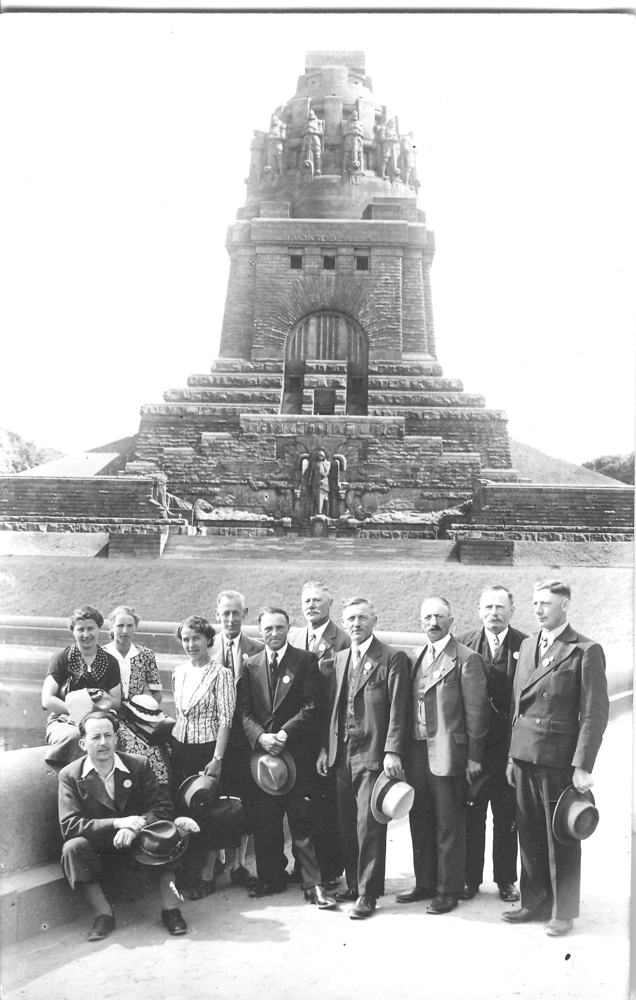

Die Einflussname der zu dieser Zeit herrschenden politischen Kräfte ist nicht mehr zu übersehen und so wird auch die Liedertafel mit einem Schreiben des kommissarischen Leiters des Oberösterreichischen Sängerbundes im Jahre 1938 aufgefordert einen Vereinsführer vorzuschlagen.
Im März 1939 werden dem Verein die zugeteilten Regelsatzungen bekannt gegeben und durch den Sängerkreisführer der vorgeschlagene Vereinsführer bestätigt. Der damalige Obmann Matthias Asen sen. unterschreibt trotz der Bestellung zum „Vereinsführer“ die Chronikberichte weiterhin mit dem Vermerk M. Asen Obmann.

Vieles wird nun als Verpflichtung den Sängern aufgebürdet. Eine Bestandserhebung ist sofort durchzuführen und die Leitsätze bzw. Regelsatzungen, herausgegeben von der Sänger-Gauführung, sind regelmäßig zu verlesen. 1939 wird von den Chören sogar das Erlernen des Pflichtchores "Das Hammerlied vom ewigen Deutschland" verlangt. Ebenso muss der Verein beim Sängerkreistag in Linz am 7. Mai 1939 unbedingt teilnehmen. Dort wird Obmann Matthias Asen und Chorleiter Karl Urbann der Besuch der Reichsnährstandsausstellung in Leipzig nahegelegt.
Über Einladung der NSDAP, der Orts-Kulturgemeinschaft beizutreten, beschließt die Liedertafel, vorläufig nicht beizutreten, erklärt sich jedoch bereit, bei kulturellen Veranstaltungen gesanglich mitzuwirken.

