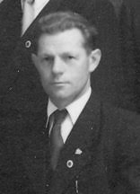

Mit dem Amtsantritt von Josef Kreil als Chorleiter, beginnt in der Vereinsgeschichte der Liedertafel eine neue Ära die man ohne Übertreibung als Blütezeit bezeichnen kann. Nach den Schrecken der beiden Weltkriege, folgt ab den 50er Jahren eine wirtschaftliche und gesellschaftliche Aufbruchstimmung, die auch das Sängerwesen im Allgemeinen erfasst. Sepp Kreil versteht es, mit viel persönlichem Engagement, diese Rahmenbedingungen im Sinne des Vereines zu nützen. Er macht die Liedertafel zu einem festen und stets präsenten Bestandteil des kulturellen Lebens von Mining, sowie dem regionalen Umfeld. Er tritt bereits im Jahr 1934, mit 20 Jahren, dem Verein bei und ist bis 1985 aktiv. Von 1951 bis 1982 leitet er selbst den Chor und übergibt dann diese Funktion an seinen Sohn Siegfried, der dieses Amt bis in das Jahr 2004 in seinem Sinne fortführt. Sepp Kreil ist von 1935 bis 1984 auch als Vereinswirt der Gastgeber am Stammtisch der Liedertafel. Auch diese wichtige Funktion wird innerhalb der Familie übergeben. Tochter Margit und Schwiegersohn Johann Mayrböck übernehmen nahtlos und sorgen bis in das Jahr 2010 dafür, dass sich die Sänger im Vereinslokal stets wie zu Hause fühlen dürfen. Schwiegersohn Johann Mayrböck ist zudem von 1982 bis 2025 aktiver Sänger der Liedertafel. Auch Sepp’s Bruder, Alois Kreil, ist von 1935 bis 1960 als Sänger aktiv! Darüber hinaus stellt die „Sängerfamilie“ Kreil/Mayrböck seit 1935, bis heute unentgeltlich, die Räumlichkeiten für die Probenarbeit zur Verfügung. Was soll man da noch sagen? Am besten verneigt man sich, still dankend!

