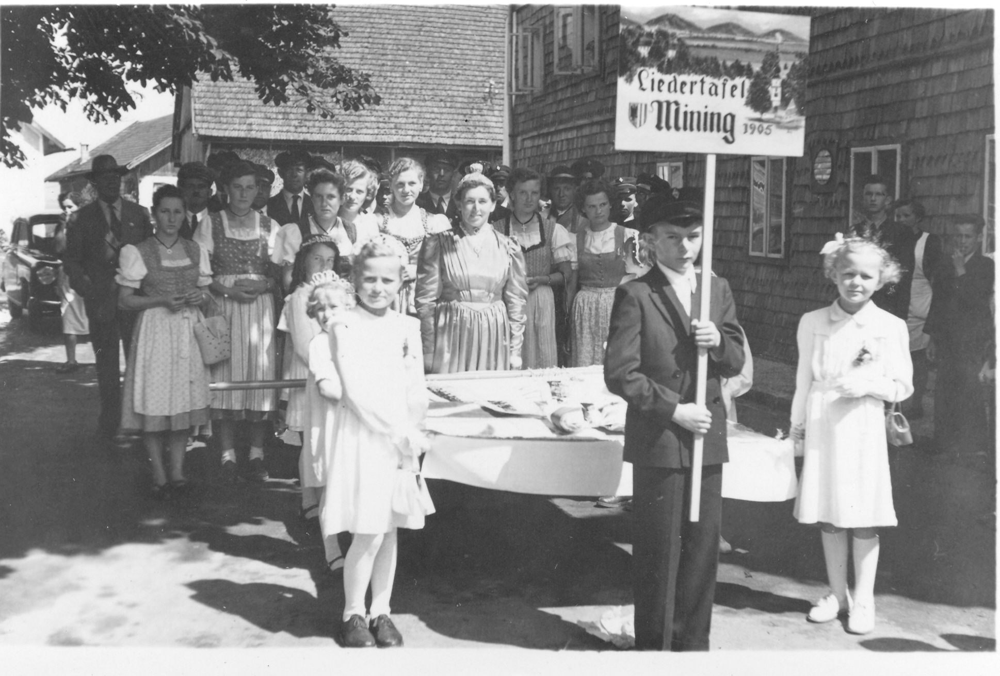
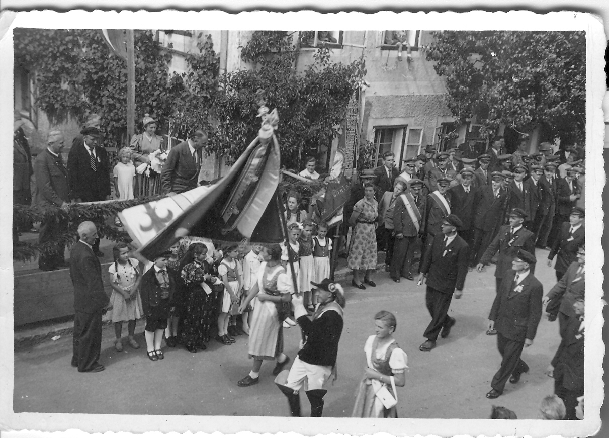
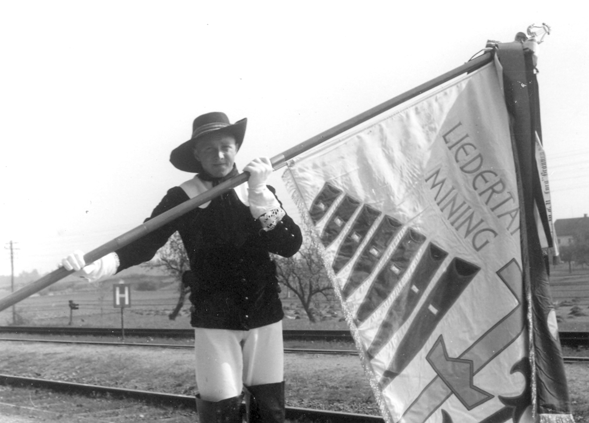

Noch lange vor der ersten einheitlichen Vereinstracht leistet sich die Liedertafel zum 50-jährigen Bestandsjubiläum erstmals eine Vereinsfahne. Erste Überlegungen in Richtung dieser symbolträchtigen Investition gab es bereits in der Gründerzeit und zwar in den Jahren 1906 und 1908. Diese wurden jedoch, vermutlich aus wirtschaftlichen Gründen, wieder verworfen. Im aufkommenden Schwung der Nachkriegszeit war es dann so weit. Am 25. April 1955 gab es die Zusage von Anna Seeburger zur Übernahme der ersten Patenschaft. So wurde das neue Aushängeschild des Vereines anlässlich des 50-jährigen Gründungsfestes am 10. Juli 1955 in Anwesenheit zahlreicher Gesangsvereine und Ehrengäste, bis hin zu Landeshauptmann Heinrich Gleissner, von Pfarrer Franz Leopoldsberger feierlich eingeweiht.  
Erster Fähnrich war der damals neu beigetretene, 21-jährige Jungsänger Georg Mertelseder.

