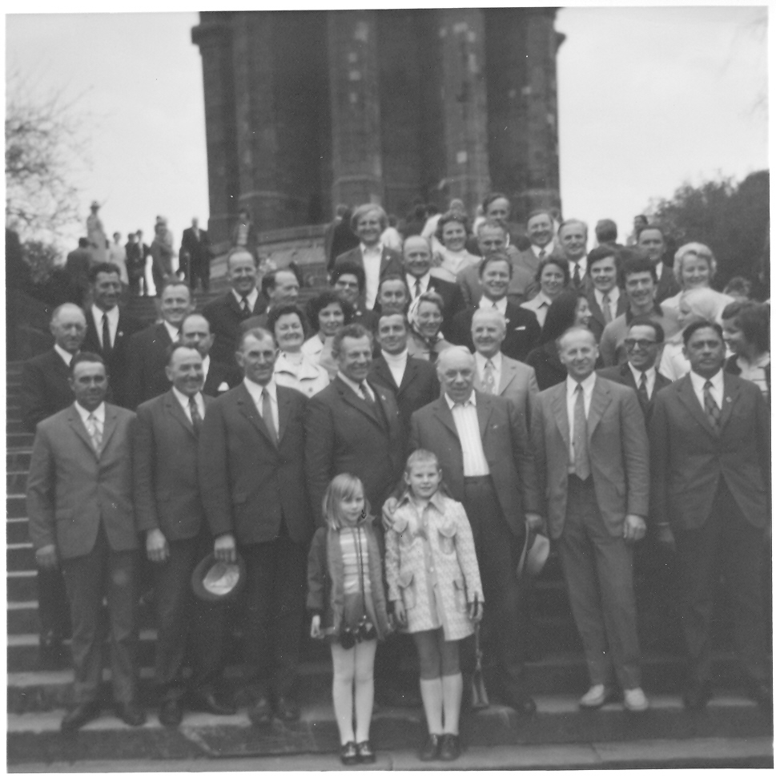
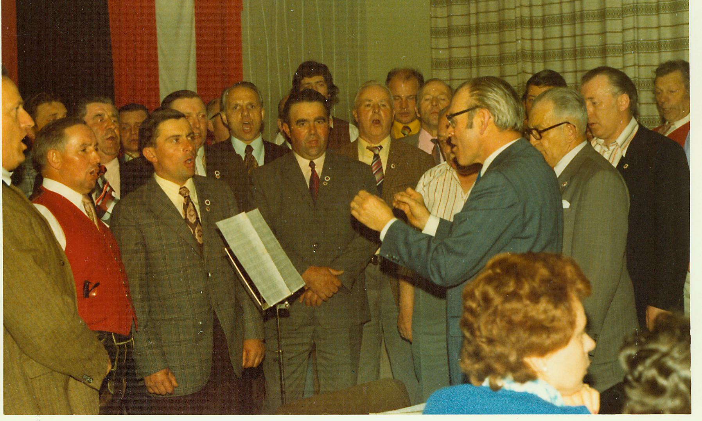
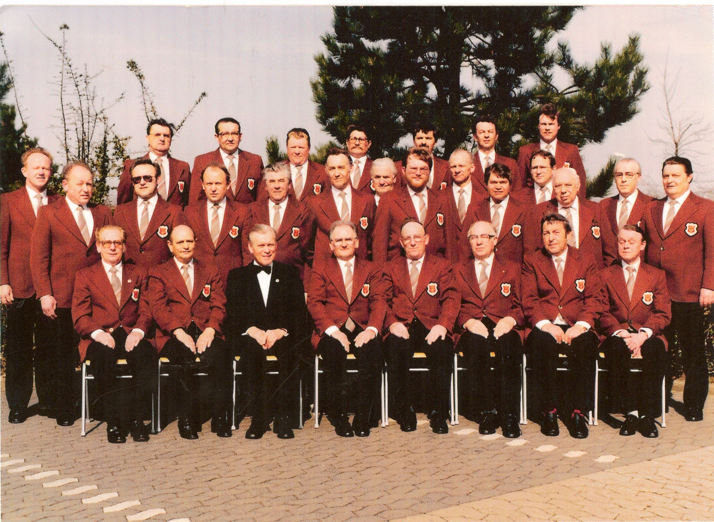

Nach umfangreicher organisatorischer Vorbereitung werden 21 Gäste aus dem 700 Kilometer entfernten Lippinghausen am 1. Mai 1971 am Bahnhof in Simbach abgeholt und in Mining herzlich empfangen.
Im Zuge dieses Besuches wird auch ein Gemeinschaftskonzert der beiden Chöre veranstaltet.
Vom 29. April bis 1. Mai 1972 kommt es dann zum Gegenbesuch.

Die Liedertafel reist nach Herford.
Auch dort wird ein gemeinsames Konzert aufgeführt.
Die Freundschaft intensiviert sich in der Folgezeit.
So kommt es im April 1974 zu einem weiteren Besuch aus Herford in Mining.
56 Personen reisen diesmal aus Herford an und es wird unter anderem ein gemeinsamer Ausflug in das Salzkammergut unternommen.
Nach einigen Verschiebungen und weiteren Diskussionen über einen nächsten Gegenbesuch, wird dieser im Jänner 1977 schließlich abgesagt.
Somit löst sich die Partnerschaft der beiden Chöre langsam wieder auf.
Einzelne private Kontakte werden jedoch durch weitere gegenseitige Besuche, Briefe und Telefonate zum Teil bis in die 90er Jahre gepflegt.

