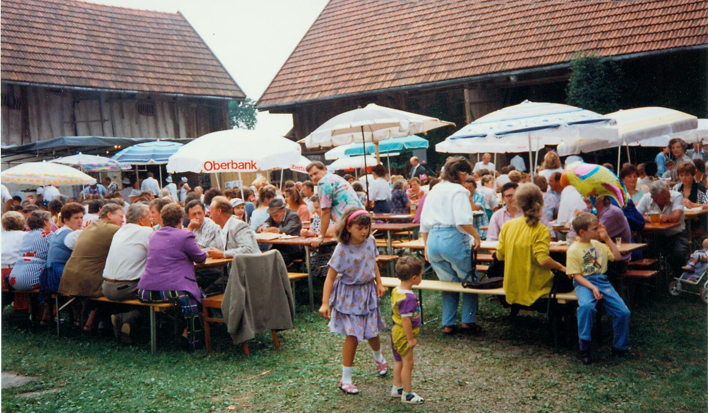
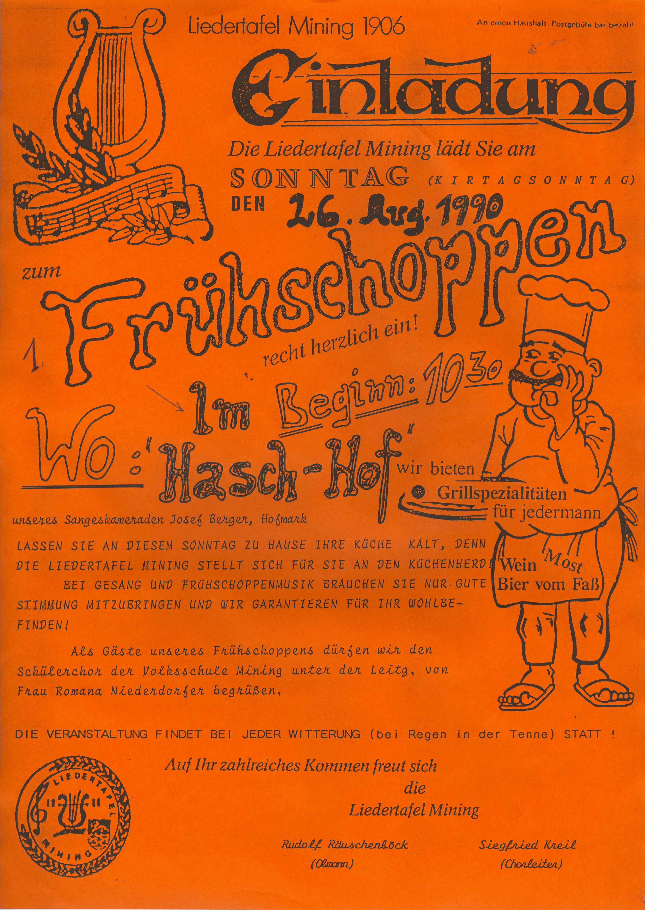

Nach dem großen Erfolg des im Jahr 1985, im Rahmen der 1100-Jahr Feier der Gemeinde Mining, veranstalteten Dorffestes, entschlossen sich die Gemeindevertreter zur erneuten Organisation eines Dorffestes im Jahr 1989. Bei solchen Anlässen sind stets auch die örtlichen Vereine eingeladen, ihre Beiträge zu leisten. So kam es zur allerersten Verköstigung mit Mostausschank durch die Liedertafel am Haschhof. Das bot sich an. Der damalige Eigentümer, Josef Berger, vlg. „Hasch“ war langjähriger, aktiver Sänger der Liedertafel und der in zentraler Lage gelegene Hof bot ein für jede Wetterlage geeignetes Ambiente. Das Fest verlieh ursprünglich auch dem damals schon in die Jahre gekommenen Kirtag mit Autodrom, Schießbude und verschiedenen Marktständen neuen Schwung.
In der Vereinschronik findet sich dazu folgender Eintrag:

> Am 27. August wurde in Mining ein Dorffest veranstaltet. Auch die L.T. entschloss sich mitzuwirken.
> Im Haschhof wurde die Liedertafel aktiv. Es wurde Most, (400 lt. Fass), gespendet von unserem Tenor Josef Berger, verkauft.
> Viele Sängerfrauen beteiligten sich an der guten Sache und bereiteten die zum Most passenden Brote zu.
> Viele Gäste kamen und hörten uns beim Singen zu. Dabei wurde viel konsumiert.
> Plötzliche Regenschauer konnten an unserem Singen keinen Abbruch tun, denn wir wechselten die Stellung und besetzten die Tenne des Haschstadels. Ein Wagen als Bühnenuntersatz mit wackeligen Beinen stand bereit und so ging das Singen im Stadel weiter.
> Der Erlös aus dieser Unterhaltung wurde der Kirche zur Restaurierung des Turmes gespendet.
> Als nicht eingeplanter Höhepunkt wurde eine Palme von der Goldhaubengruppe Mining, mitten im Hof des Haschgutes amerikanisch versteigert. Unser Chorleiter führte die Versteigerung.
> Seine Redegewanntheit führte zu einem sehr guten Versteigerungserfolg. So nahm das Dorffest einen guten Verlauf, bis auf ein paar Sänger, die das Ende des Dorffestes nicht glauben konnten.
> So blieb dem Hausherrn nichts anderes übrig, als einen Stromausfall zu organisieren.

Aufgrund des Erfolgs dieser Veranstaltung, entschloss sich die Liedertafel schließlich ab dem Jahr 1990, den Kirtag alljährlich mit einem Sängerfrühschoppen zu begleiten. Das wurde von der Bevölkerung sehr gut angenommen. Zum 20-jährigen Jubiläum wurde im Jahr 2009 erstmals am Freitag vor dem Sängerfrühschoppen auch ein Kirtagstanz abgehalten. So wurde aus dem ursprünglichen Beitrag zum Dorffest 1989 schließlich der alljährliche „Kirtag am Haschhof“. Ein zentraler Dreh- und Angelpunkt im Vereinsleben der Liedertafel, sowohl in wirtschaftlicher, als auch in gesellschaftlicher Hinsicht. Erwähnenswert ist auch, dass eine ganze Generation damaliger Kinder mit dem Haschfest als jährlichem Fixpunkt herangewachsen ist und nun in den 20er Jahren, selbst erwachsen geworden, mit ihren eigenen Kindern nach wie vor dem Haschfest die Treue halten. Hier wird der Spruch „Tradition ist nicht die Anbetung der Asche, sondern die Weitergabe des Feuers“ zur gelebten Realität!

