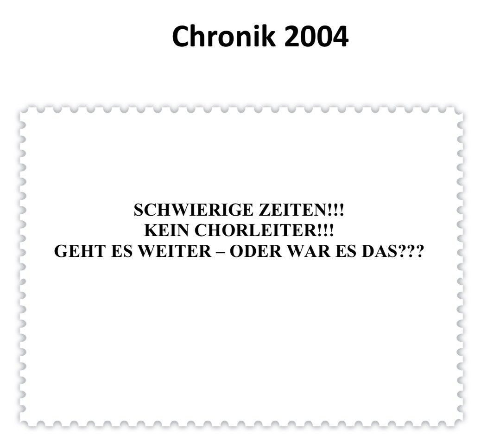
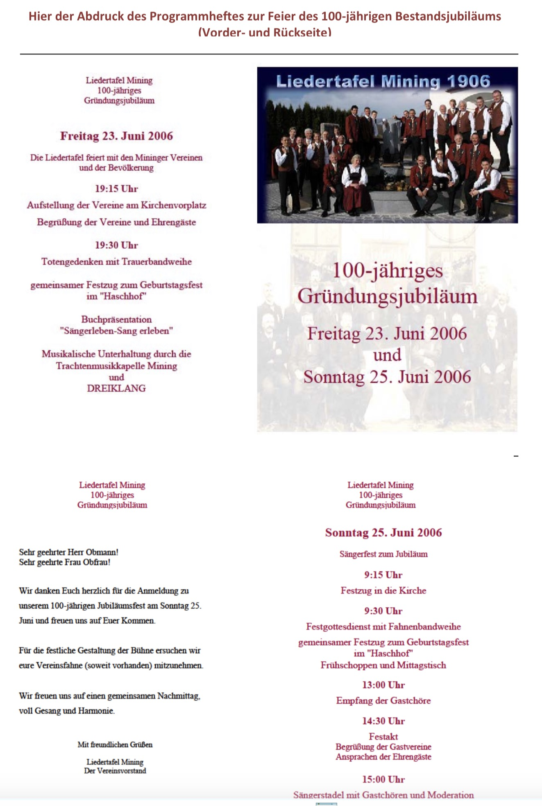
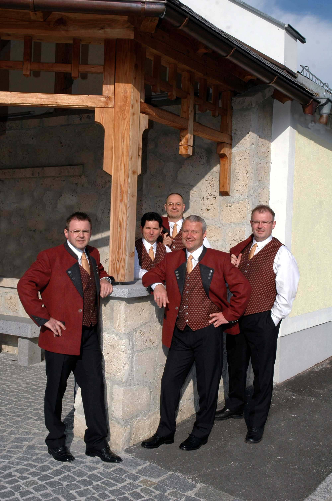
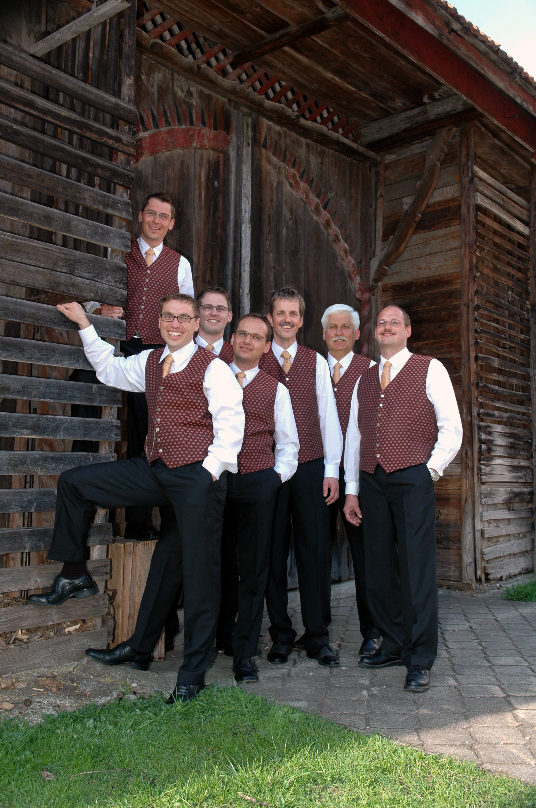
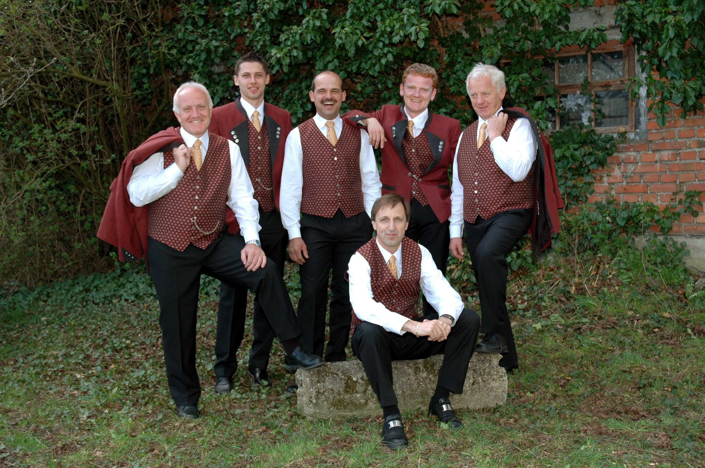
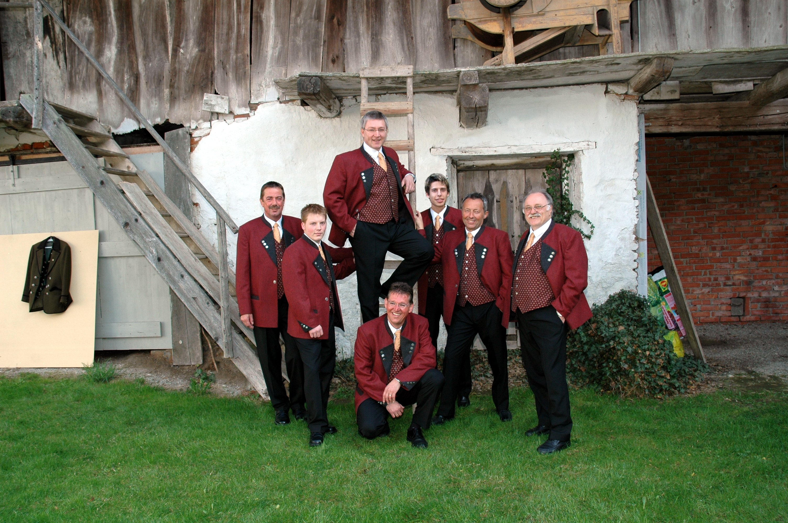

Mit einem 2-tägigen Fest wird das 100-jährige Bestehen der Liedertafel gebührend gefeiert.
Ganz traditionell mit Festakt, Vereinsempfang, Festgottesdienst, Fahnenbandweihe und allem was dazugehört.
Das Vereinsgeschichtsbuch „Sängerleben“ wird der Öffentlichkeit vorgestellt.
Fahnenpatin Erna Mertelseder übergibt ihr Ehrenamt an die Nachfolgerin Sabine Räuschenböck und die Liedertafel präsentiert sich mit ihrer neuen Tracht.

Dies alles sind sichtbare Signale für den erfolgreich vollzogenen Umbruch.
Aber so einfach, wie es in der Rückschau aussehen mag war es gar nicht.
Der Fortbestand des Vereins stand ab dem Jahr 2004, nach dem unerwartet raschen Abgang von Siegfried Kreil, der den Verein über so viele Jahr getragen hatte, durchaus auf der Kippe!

Der Umbruch begann bereits 2003 mit dem wohl vorbereiteten Wechsel in der Vereinsführung, als Rudolf Räuschenböck die Funktion des Obmanns an seinen Nachfolger Josef Gross übergab.
Viel schwieriger gestaltete sich die Frage der Neubesetzung der musikalischen Leitung.
Fahnenpatin Erna Mertelseder mahnte mit eindringlichen Worten die teils bereits zur Resignation tendierenden Stimmen, die Kräfte neu zu bündeln und den Fortbestand des seit bald 100 Jahren bestehenden Vereines zu ermöglichen.
Schließlich wagte Alexander Mayrböck den mutigen Schritt, die musikalische Leitung zu übernehmen und so kam nach und nach wieder neuer Schwung in die Unternehmung.
Im Zuge der 100-Jahr-Feierlichkeiten kam dies sichtbar zum Ausdruck.

Der Übergang war geschafft. Wieder einmal!

