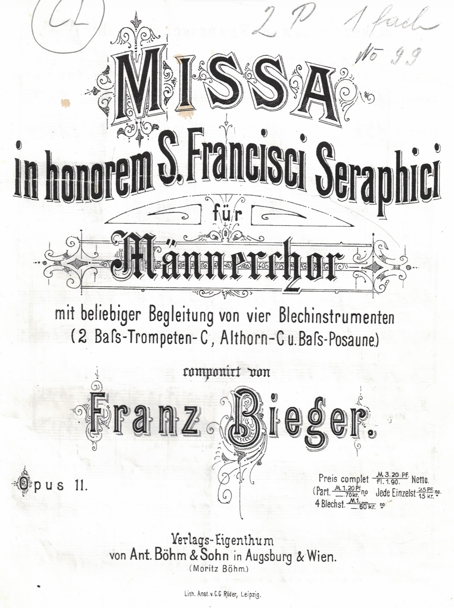
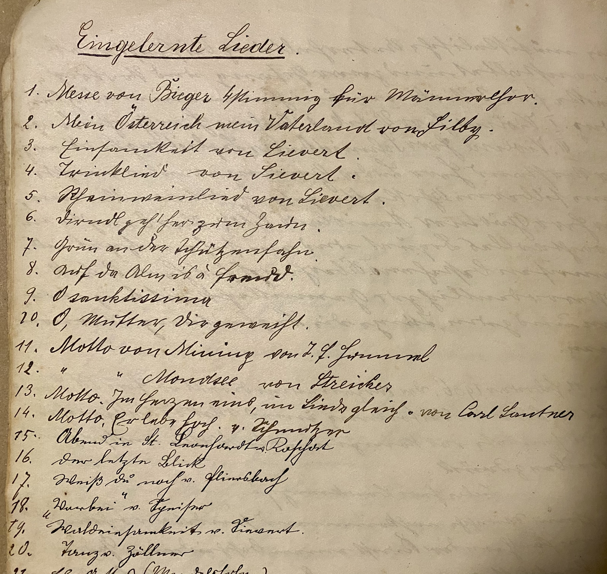
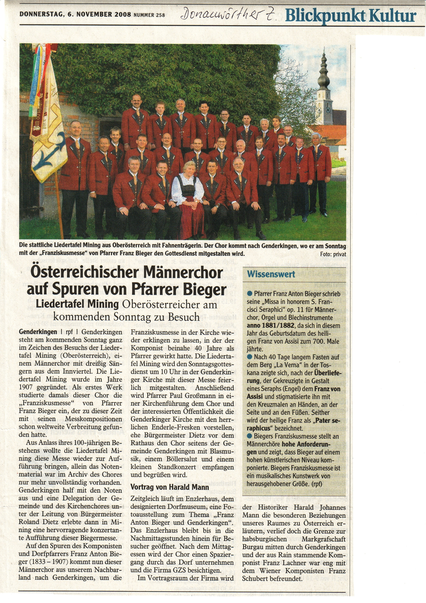
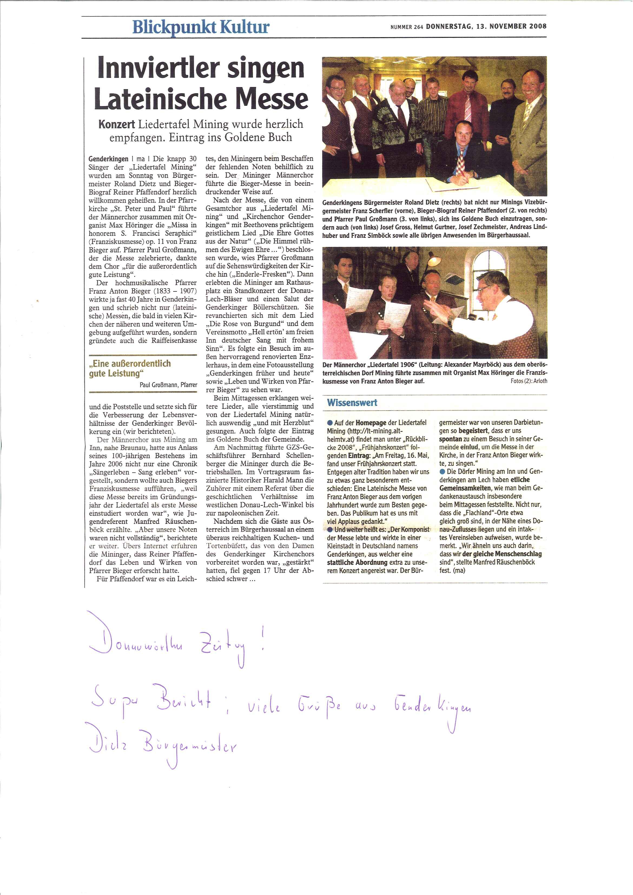

Ein erstes, in der Chronik enthaltenes Verzeichnis der „Eingelernten Lieder“ aus dem Jahr 1906, zeigt die „Messe von Bieger 4-stimmig für Männerchor“ an Position 1. Am Sonntag, den 7. Jänner 1906, also noch vor der formellen Vereinsgründung, kam diese erstmals zur Aufführung.
Bereits nach einer neuerlichen Aufführung im Jahr 1906 wurde es dann ruhig um die Bieger-Messe.
Es begann der Dornröschenschlaf.

Erst im Zuge der Recherchen zum Vereinsgeschichtsbuch „Sängerleben“ im Jahr 2005 wird das doch recht anspruchsvolle Werk wiederentdeckt und ab 15. Mai 2007 neu einstudiert.
Fast genau ein Jahr später, am 16. Mai 2008, wird die Messe im Rahmen eines denkwürdigen Kirchenkonzertes in der Pfarrkirche Mining erneut dem Publikum vorgestellt und findet sowohl bei den Sängern, als auch bei den Zuhörern begeisterten Zuspruch.
Die neuerliche Uraufführung wird von Monsignore Leon Sireisky liturgisch kommentiert und von einem Posaunenquartett der Landesmusikschule Altheim unter Leitung von Franz Strasser, sowie von Johannes Wilhelm an der Kirchenorgel begleitet.
Eine Abordnung aus Genderkingen, dem Heimatort des Komponisten, reist aus Bayern an, um dieser Aufführung beizuwohnen.
Auf Einladung der bayerischen Gäste gestaltet die Liedertafel mit diesem Werk am 9. November 2008 auch eine heilige Messe in Genderkingen.
Die Begleitung übernimmt diesmal der dortige Dorforganist Max Höringer, der mit der Komposition bestens vertraut ist.
Der Besuch in Genderkingen wird angesichts des überaus freundlichen, ja begeisterten Empfangs, sowie dank der spürbaren Wertschätzung für die Qualität der Aufführung des Bieger-Werkes, für alle Teilnehmer zu einem unvergesslichen Erlebnis.
Weitere Aufführungen erfolgen noch im selben Jahr in Pischelsdorf und zur Cäcilia-Messe in Mining.

